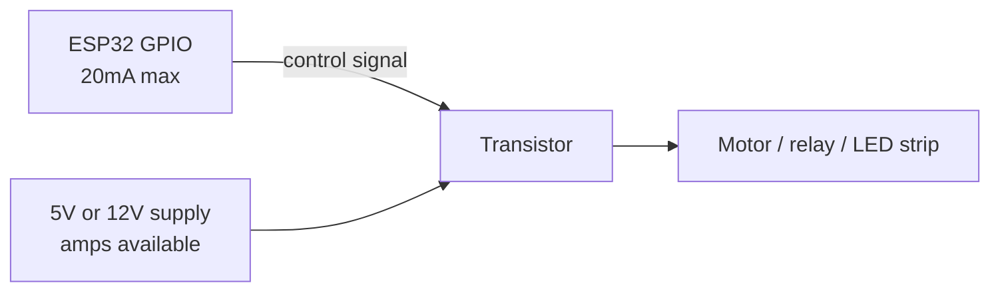

A transistor is an electrically operated switch, you feed it a tiny signal from a GPIO and it switches a much bigger current somewhere else.

You need one the moment your load is bigger than a single LED. An ESP32 GPIO can give you about 20mA safely. A motor wants 500mA. A relay coil wants 70mA. A strip of LEDs wants an amp. The GPIO cannot do it, so the GPIO controls a transistor and the transistor does the work.

The key idea: the transistor's power comes from the supply rail, not from the pin. The pin only tells it what to do.



Two families

|  |BJT (e.g. 2N2222, BC547)|MOSFET (e.g. IRLZ44N, AO3400)|
|---|---|---|
|Controlled by|Current into the base|Voltage on the gate|
|Needs a resistor?|Yes, base resistor, mandatory|Yes, but only a small gate resistor, optional-ish|
|Draws control current|Yes, a few mA continuously|Almost none|
|Loss when on|~0.2V to 0.7V across it|As low as 0.02V, they run cold|
|Good for|Small loads, up to ~500mA|Anything, especially amps|
|Gotcha|Needs base current calculated|Must be **logic-level** on 3.3V|

Start with BJTs to understand it, use MOSFETs for anything real.

Pin names

|BJT|MOSFET|Job|
|---|---|---|
|Base (B)|Gate (G)|The control input from the GPIO|
|Collector (C)|Drain (D)|Where the load connects|
|Emitter (E)|Source (S)|Goes to GND (for NPN / N-channel)|

Schematic symbols

```
   NPN                        N-channel MOSFET

        C                            D
        │                            │
   B ───┤                       G ───┤
        │↘                           │
        E                            S
```

The arrow on the emitter points out for NPN. For MOSFETs the body diode arrow points from source to drain. In practice you just check the datasheet pinout, because there is no universal leg order.

NPN vs N-channel, and the "low side" rule

Both of these switch the **negative** side of the load. The load connects to the positive rail, and the transistor sits between the load and GND. This is called low-side switching and it is the easy one. Do it this way.

```
   5V ────────[LOAD]─────┐
                         │ C / D
   GPIO ──[1kΩ]──────────┤ B / G
                         │ E / S
   GND ──────────────────┘
```

|From|To|Note|
|---|---|---|
|5V supply|Load positive terminal|load's own supply, not the ESP32 3V3|
|Load negative terminal|Transistor collector (BJT) or drain (MOSFET)|-|
|ESP32 GPIO|Resistor leg 1|1kΩ for BJT, 100Ω-220Ω for MOSFET|
|Resistor leg 2|Transistor base or gate|-|
|Transistor emitter / source|GND|-|
|ESP32 GND|Same GND|**grounds must be joined or nothing works**|

That last row is the one people miss. If the load has its own power supply, its ground and the ESP32's ground must be physically connected. The GPIO signal is measured relative to ground, and without a shared one there is no reference.

The gate / base resistor

For a BJT, the base resistor sets the current that turns it on. Without it, the base junction looks like a 0.7V diode straight to ground and the GPIO tries to deliver unlimited current into it. That kills the pin.

Rough sizing for a BJT:

```
Ib = Ic / 20              (drive it hard, don't use the real hFE)
Rb = (3.3 - 0.7) / Ib

Load = 200mA
Ib   = 200 / 20 = 10mA
Rb   = 2.6 / 0.010 = 260Ω  ->  use 220Ω
```

For light loads under 50mA, 1kΩ is fine and is what everybody uses by default.

For a MOSFET the gate is a capacitor, not a diode. It does not need current to stay on, but charging it draws a big spike for a microsecond. A 100Ω to 220Ω gate resistor limits that spike so the GPIO is not hit with an instantaneous short. It is genuinely optional at low switching speeds but costs nothing.

Add a 10kΩ pull-down from gate to GND as well. Before `setup()` runs, the GPIO is floating, and a floating MOSFET gate can drift high and switch your motor on at power-up. The pull-down holds it off.

```
   GPIO ──[220Ω]──┬── G
                  │
               [10kΩ]
                  │
                 GND
```

|From|To|Note|
|---|---|---|
|ESP32 GPIO|220Ω resistor|limits gate charge current|
|220Ω resistor|MOSFET gate|-|
|MOSFET gate|10kΩ resistor|-|
|10kΩ resistor|GND|holds the gate off during boot|

Logic-level MOSFETs, the 3.3V trap

This is the number one MOSFET mistake and it wastes whole evenings.

A MOSFET turns on when the gate voltage exceeds its threshold, Vgs(th). A standard MOSFET like the very popular **IRF540N** needs around 10V on the gate to turn fully on. An ESP32 gives 3.3V. At 3.3V the IRF540N is barely cracked open, so it conducts a bit, drops a couple of volts, gets hot, and your motor runs slow and weak. It looks like a power supply problem. It is not.

You need a **logic-level** MOSFET, one specified to be fully on at 2.5V or less.

|Part|Fully on at|Notes|
|---|---|---|
|IRF540N|10V|**Do not use on 3.3V**|
|IRLZ44N|4V-5V|Marginal on 3.3V, better on 5V|
|IRLB8721|2.5V|Good choice for 3.3V, up to ~60A|
|AO3400|2.5V|Tiny SMD, great for a few amps|
|2N7000|2.5V|Small signal only, ~200mA|
|BS170|2.5V|Small signal only|

Rule of thumb: if the part number has an **L** in it (IR**L**Z44N, IR**L**B8721), it is usually the logic-level version of a standard part. IRF540N vs IRL540N. Check the datasheet for "Rds(on) at Vgs = 2.5V" or "at Vgs = 4.5V". If the datasheet only quotes Rds(on) at 10V, walk away.

Even on a "logic level" part, 3.3V is often the weakest supported case. If your MOSFET is getting warm, that is a sign it is not fully on.

Driving it

```cpp
#define MOSFET_PIN 5

void setup() {
  pinMode(MOSFET_PIN, OUTPUT);
  digitalWrite(MOSFET_PIN, LOW);   // off first, before anything else
}

void loop() {
  digitalWrite(MOSFET_PIN, HIGH);  // load on
  delay(1000);
  digitalWrite(MOSFET_PIN, LOW);   // load off
  delay(1000);
}
```

Speed control with PWM, using the ESP32's LEDC hardware:

```cpp
#define MOSFET_PIN 5

void setup() {
  ledcAttach(MOSFET_PIN, 1000, 8);   // 1kHz, 8 bit
}

void loop() {
  ledcWrite(MOSFET_PIN, 128);   // 50% power
  delay(2000);
  ledcWrite(MOSFET_PIN, 255);   // full
  delay(2000);
  ledcWrite(MOSFET_PIN, 0);     // off
  delay(2000);
}
```

If the load is a motor or a relay, put a flyback diode across it. See [[Flyback diode protection]].

The mistake everyone makes

Using an IRF540N because it was in the kit, then spending three hours debugging a motor that runs at half speed while the MOSFET slowly cooks. It is not the battery, it is not the code, it is the gate threshold. 3.3V does not turn that part on.

Second: no shared ground between the ESP32 and the external supply. Everything looks correctly wired and nothing switches.

Third: no gate pull-down, so the motor spins for half a second every time you press reset.
