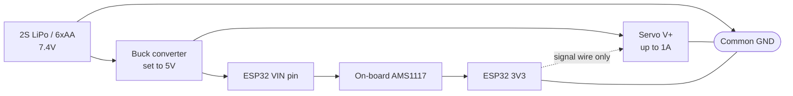

A voltage regulator takes a messy, drooping input voltage and turns it into a steady output voltage your chips can actually run on.

A battery is not a fixed voltage. A fresh 9V block is 9.6V, a flat one is 7V. A 2-cell LiPo swings from 8.4V down to 6.6V. Chips need a stable rail, so something has to sit in between.

Two ways of doing it

|  |Linear (LDO)|Switching (buck)|
|---|---|---|
|How|Burns the excess as heat|Chops the input rapidly and filters it|
|Efficiency|(Vout / Vin), so often terrible|85% - 95% regardless|
|Waste heat|A lot|Very little|
|Noise on the output|Very clean|Some switching ripple|
|Cost / size|Tiny, one chip|Module with an inductor|
|Typical part|AMS1117-3.3, LM7805, MCP1700|MP1584, LM2596, MP2307|
|Good for|Under 200mA, small voltage gap|Anything with current, big voltage gap|

Schematic symbol

```
        ┌───────────┐
  IN ───┤ IN    OUT ├─── OUT
        │    GND    │
        └─────┬─────┘
             GND
```

Three terminals, always. Input, output, common ground. The ground is shared between in and out, that is what makes it a reference.

The heat problem, with numbers

A linear regulator wastes `(Vin - Vout) × I` as heat. It cannot do anything else, that is literally its mechanism.

Worked example, 9V battery to 3.3V, ESP32 pulling 250mA on WiFi transmit:

```
Wasted = (9 - 3.3) × 0.25
       = 5.7 × 0.25
       = 1.43W
```

1.43W in a package the size of a grain of rice. An AMS1117 in SOT-223 can shift maybe 0.8W before it hits thermal shutdown. So it will get too hot to touch, then start cutting out, and your ESP32 will reset every time WiFi kicks in. This is an extremely common "my ESP32 randomly reboots" cause.

Same job with a buck converter:

```
Output power  = 3.3 × 0.25 = 0.83W
At 90% eff    = 0.92W drawn from the battery
Wasted        = 0.09W
```

0.09W. Nothing. And your battery lasts nearly three times longer.

Rule: if `(Vin - Vout) × I` comes out above about half a watt, use a buck converter.

Dropout voltage

A linear regulator needs the input to be a certain amount above the output or it stops regulating and just passes through whatever it has, sagging.

|Part|Output|Dropout|Minimum input|
|---|---|---|---|
|LM7805|5V|~2V|7V|
|AMS1117-3.3|3.3V|~1.1V|4.4V|
|MCP1700-3302|3.3V|~0.18V|3.5V|
|HT7333|3.3V|~0.1V|3.4V|

"LDO" means Low DropOut, and it matters enormously on battery. If you want 3.3V from a single LiPo cell that falls to 3.4V when nearly flat, an AMS1117 gives up at 4.4V and you throw away most of the battery's capacity. An HT7333 keeps going almost to the end.

The ESP32 dev board already has one

Your dev board has an AMS1117-3.3 on it. This is why the pin labelled `3V3` exists. It is fed from either USB 5V or the `VIN` pin.

|Pin|What it is|
|---|---|
|`5V` / `VIN` / `V5`|Straight to USB 5V, and also an input if you power externally|
|`3V3`|Output of the on-board regulator|
|`GND`|Common ground|
|`EN`|Reset, pull low to reset the chip|

Two things to know. First, that on-board regulator is small, do not try to run servos or LED strips off the `3V3` pin, you will brown out the whole board. A couple of sensors is fine, that is what it is for. Second, `VIN` accepts roughly 5V to 12V, but feeding it 12V means the regulator burns `(12 - 3.3) × I` and gets seriously hot. Feed it 5V from a buck converter instead.

Never feed anything above 3.3V into a GPIO pin. The regulator supplies the chip, it does not protect the pins.

Worked build: one battery, a 5V servo and a 3.3V ESP32

This is the classic beginner project and it goes wrong for a predictable reason. A servo pulls 500mA to over 1A when it stalls. If it shares the ESP32's regulator, the rail collapses and the board resets mid-move.

The answer is: **one battery, two separate supply paths, one shared ground.**



```
   7.4V ───┬──────────────────────────────┐
           │                              │
      ┌────┴─────┐                        │
      │  BUCK    │                        │
      │  → 5.0V  │                        │
      └────┬─────┘                        │
           │                              │
           ├───────────── SERVO V+ (red)  │
           │                              │
           └───────────── ESP32 VIN       │
                                          │
   ESP32 GPIO13 ──────── SERVO signal (orange)
                                          │
   GND ────┬──── SERVO GND (brown) ───────┘
           │
           └──── ESP32 GND
```

|From|To|Note|
|---|---|---|
|Battery +|Buck converter IN+|7.4V from 2S LiPo or 6 AA cells|
|Battery -|Buck converter IN-|-|
|Buck OUT+|Servo red wire|**set the buck to 5.0V with a multimeter before connecting anything**|
|Buck OUT+|ESP32 VIN pin|on-board LDO makes 3.3V from this|
|Buck OUT-|Servo brown wire|-|
|Buck OUT-|ESP32 GND|**one common ground, this is essential**|
|ESP32 GPIO13|Servo orange wire|signal only, no current|
|Buck OUT+ to OUT-|470µF electrolytic|absorbs the servo's current spikes|

The 470µF across the 5V rail is not optional in practice. Without it the servo's inrush drags the rail down far enough to reset the ESP32.

Setting a buck module

Cheap LM2596 and MP1584 modules have a little trimmer screw. Do this before you connect the load:

1. Connect input power only, output floating.
2. Multimeter across the output terminals.
3. Turn the screw until it reads 5.00V. It may need many turns before anything moves.
4. Now connect the load.

If you connect a 5V device while the module is still set to whatever it shipped at, which could be 12V, you destroy it instantly.

Picking one

|Situation|Use|
|---|---|
|USB powered project|Nothing, the board's own regulator is fine|
|A few sensors on 3.3V|Board's `3V3` pin|
|Motors, servos, LED strips|Buck converter, separate from the logic|
|Single LiPo cell to 3.3V|Low dropout LDO, e.g. HT7333|
|9V battery to anything|Buck converter, or better, use a different battery|
|Need it very quiet, e.g. audio, precision analogue|Linear LDO after a buck|

9V PP3 batteries are a trap generally. They hold very little energy, maybe 500mAh, and they are the highest voltage so they waste the most in regulation. Four AA cells or a LiPo are better in every way.

The mistake everyone makes

Powering a servo or a motor from the ESP32's `3V3` pin. The on-board regulator can supply a few hundred mA at most and the servo wants more than that in bursts. The symptom is the board resetting or the serial monitor spewing a boot log every time the motor moves. It looks like a software crash. It is a power problem, every time.

Second: `VIN` is not a magic input. It sits behind the regulator, so feeding 12V into it means the tiny AMS1117 has to drop 8.7V. Feed it 5V.

Third: forgetting the common ground when you add a second supply. Nothing works, and there is no clue as to why.
