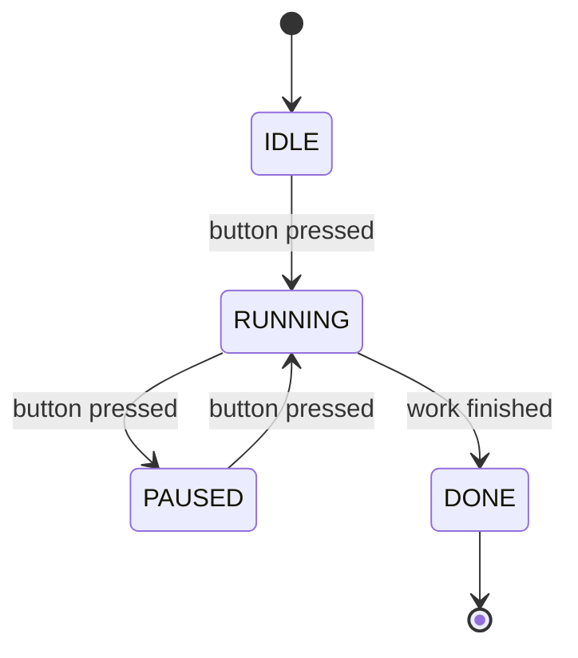
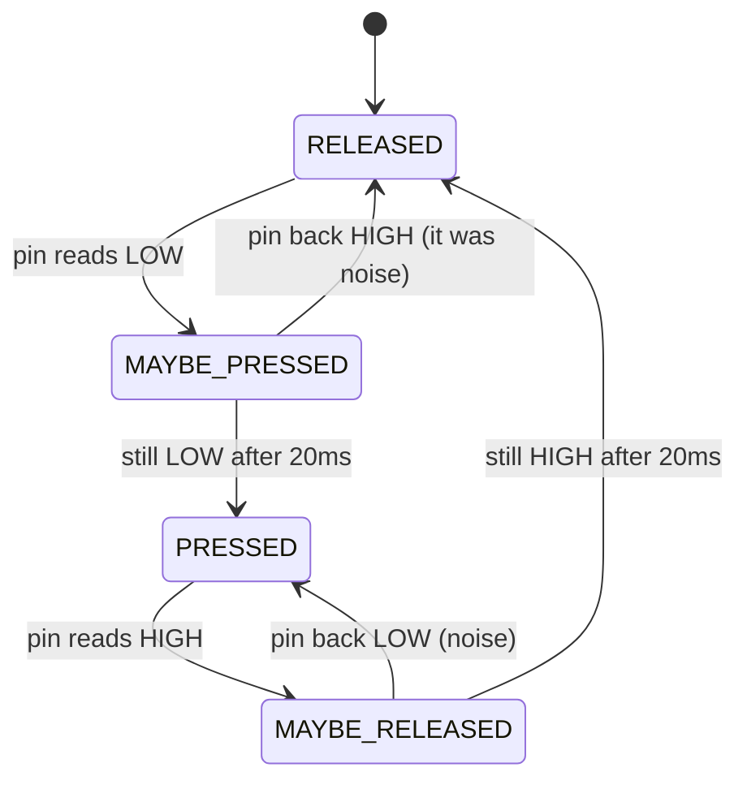

A state machine is just an enum saying what the system is currently doing, and a switch deciding what happens next, and it replaces most tangled boolean flags.

The problem it solves

```cpp
// this is what code looks like without one

bool isOn = false;
bool wasPressed = false;
bool isLongPress = false;
bool ignoreNext = false;
bool inSetupMode = false;

// six months later nobody knows which combinations are legal,
// and half of them are impossible but the code still checks them
```

The shape

```cpp
/*
1. an enum listing every state the thing can be in
2. one variable holding the current state
3. a switch in loop() with one case per state
4. each case does its work and decides whether to move on
*/

typedef enum {
    IDLE,
    RUNNING,
    PAUSED,
    DONE
} State;

State state = IDLE;

void loop() {
    switch (state) {

        case IDLE:
            if (buttonPressed()) {
                state = RUNNING;
            }
            break;

        case RUNNING:
            doWork();
            if (finished())      state = DONE;
            if (buttonPressed()) state = PAUSED;
            break;

        case PAUSED:
            if (buttonPressed()) state = RUNNING;
            break;

        case DONE:
            blinkLed();
            break;
    }
}
```



A real one, a debounced button

```
  what a switch contact actually does when you press it

   3V3 ────┐
           │   ┌┐ ┌─┐  ┌┐
           └───┘└─┘ └──┘└──────────────  settled LOW
   0V

           ├─── ~5-20ms of bounce ───┤

  digitalRead during that window returns HIGH, LOW, HIGH, LOW...
  and a naive edge detector counts five presses for one push.
```



```cpp
/*
1. RELEASED and PRESSED are the settled states
2. the MAYBE_ states are "I saw a change, let's wait and see if it sticks"
3. no delay() anywhere, so this runs alongside everything else
4. one clean press event per physical push, guaranteed
*/

#define BUTTON 4
#define DEBOUNCE_MS 20

typedef enum {
    RELEASED,
    MAYBE_PRESSED,
    PRESSED,
    MAYBE_RELEASED
} BtnState;

BtnState btn = RELEASED;
unsigned long changedAt = 0;

int pressCount = 0;

void setup() {
    Serial.begin(115200);
    pinMode(BUTTON, INPUT_PULLUP);
}

void loop() {
    bool low = (digitalRead(BUTTON) == LOW);    // LOW = pressed, pull-up
    unsigned long now = millis();

    switch (btn) {

        case RELEASED:
            if (low) {
                btn = MAYBE_PRESSED;
                changedAt = now;
            }
            break;

        case MAYBE_PRESSED:
            if (!low) {
                btn = RELEASED;                  // it was just noise
            } else if (now - changedAt >= DEBOUNCE_MS) {
                btn = PRESSED;

                pressCount++;                    // the real press event
                Serial.println(pressCount);
            }
            break;

        case PRESSED:
            if (!low) {
                btn = MAYBE_RELEASED;
                changedAt = now;
            }
            break;

        case MAYBE_RELEASED:
            if (low) {
                btn = PRESSED;                   // noise again
            } else if (now - changedAt >= DEBOUNCE_MS) {
                btn = RELEASED;
            }
            break;
    }
}

// output: 1
//         2
//         3      one line per actual push, no matter how bouncy
```

Adding a long press, which is where flags would have collapsed

```cpp
/*
1. record when the press started
2. while PRESSED, check how long it has been held
3. a "fired" flag stops it repeating every pass
4. adding this to a boolean-flag version means rewriting the lot
*/

case PRESSED:
    if (!fired && now - changedAt >= 1000) {
        fired = true;
        Serial.println("long press");
    }
    if (!low) {
        if (!fired) Serial.println("short press");
        fired = false;
        btn = MAYBE_RELEASED;
        changedAt = now;
    }
    break;
```

Entry and exit actions, when a state needs setup

```cpp
/*
1. sometimes something must happen ONCE on entering a state
2. a small helper keeps that in one place instead of scattered
*/

void setState(State next) {
    // exit the old one
    switch (state) {
        case RUNNING: motorOff(); break;
        default: break;
    }

    state = next;
    stateEnteredAt = millis();

    // enter the new one
    switch (state) {
        case RUNNING: motorOn();  break;
        case DONE:    beep();     break;
        default: break;
    }
}
```

A state table, when there are a lot of states

|Current|Event|Next|Action|
|---|---|---|---|
|IDLE|button|RUNNING|start motor|
|RUNNING|button|PAUSED|stop motor|
|RUNNING|timeout|DONE|stop motor, beep|
|PAUSED|button|RUNNING|start motor|
|PAUSED|10s idle|IDLE|-|
|DONE|button|IDLE|-|

Writing the table out first catches the transitions you forgot.

Why it's worth it

|Flags|State machine|
|---|---|
|N booleans = 2^N combinations, most illegal|N states, all of them valid|
|Impossible to draw|Draws itself as a diagram|
|Adding a feature touches everything|Adding a state is one `case`|
|"How did it get into this mode?"|Print the state and you know|

The gotcha

```
  Never delay() inside a state machine. The whole point is that
  loop() keeps spinning, see [[Non-blocking timing]]. Time-based
  transitions compare millis() against when the state was entered.

  Watch out for a case falling through into the next one, C does
  that silently. Every case needs a break.

  And a state variable shared with an ISR must be volatile,
  see [[Volatile and interrupt safety]].
```
