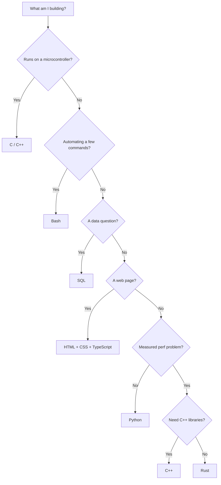

# Languages

Every language in the vault, each with its own **Libraries** section.

Choosing between them: [[03 — PROGRAMMING]] · Performance: [[33 — SYSTEMS PERFORMANCE]]

---

## The languages

| Language | Core | Libraries | Use for |
|---|---|---|---|
| **Python** | [[Python]] | **[[Python libraries]]** | Data, ML, APIs, scripting — the default |
| **Rust** | [[Rust]] | **[[Rust crates]]** | Fast safe services, ingestion, extensions |
| **C++** | [[C++]] | **[[C++ libraries]]** | LibTorch, ONNX, CUDA, robotics |
| **C** | [[C]] | **[[C libraries]]** | Embedded, microcontrollers |
| **SQL** | [[SQL]] | **[[SQL dialects and tools]]** | Anything touching a database |
| **TypeScript** | [[TypeScript]] | **[[TypeScript libraries]]** | Typed frontends and backends |
| **JavaScript** | [[JavaScript]] | **[[JavaScript libraries]]** | The web runtime |
| **HTML** | [[HTML]] | **[[HTML tooling]]** | Page structure |
| **CSS** | [[CSS]] | **[[CSS libraries]]** | Styling |
| **Bash** | [[Bash]] | **[[Command reference]]** | Glue, CI, servers, Docker entrypoints |

## Deep references

| Note | For |
|---|---|
| [[SQL fundamentals]] | Window functions, execution order, query plans |
| [[PySpark reference]] | The complete distributed-DataFrame API |
| [[Systems performance]] | When to leave Python, and what for |
| [[C++ for this stack]] | ONNX Runtime, LibTorch, custom PyTorch ops |
| [[Rust for this stack]] | Ingestion, PyO3 extensions, Actix serving |
| [[CUDA and GPU programming]] | GPU kernels |
| [[Algorithms and data structures reference]] | Complexity, code, when to use each |

## Choosing

> **Read [[When to leave Python]] before rewriting anything for speed.** Most "Python is slow" is a Python loop wrapped around a fast library — and no rewrite fixes an I/O bottleneck.

## Related

[[03 — PROGRAMMING]] · [[Stack]] · [[Tools]] · [[The 10x Engineer]]
