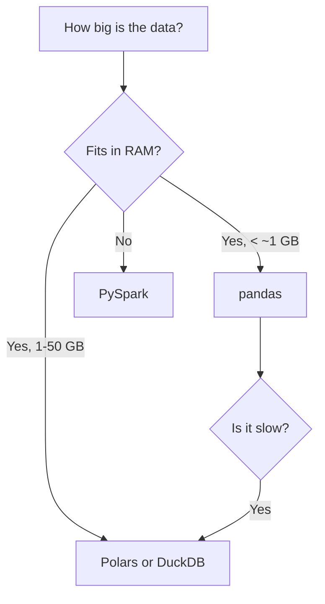

# Python libraries

Every Python library in this vault, with the full API. **Start here when you need to look something up.**

Language: [[Python]] · Section: [[03 — PROGRAMMING]]

---

## Data

| Library | For | Note |
|---|---|---|
| **pandas** | DataFrames in memory | [[pandas]] |
| **NumPy** | Arrays and numerical computing | [[NumPy]] |
| **Polars** | Faster DataFrames, Rust-backed | [[Polars]] |
| **PySpark** | Distributed DataFrames | [[PySpark reference]] |
| **DuckDB** | SQL over local files | [[DuckDB]] |

## Machine learning

| Library | For | Note |
|---|---|---|
| **PyTorch** | Deep learning | [[Tensors, autograd and the training loop]] |
| **scikit-learn** | Classical ML, preprocessing, metrics | [[scikit-learn]] |
| **MLflow** | Experiment tracking, model registry | [[MLflow experiment tracking]] |
| **ONNX Runtime** | Fast inference, no PyTorch needed | [[Model export and serving]] |
| TensorFlow / Keras | The alternative framework | [[TensorFlow and Keras]] |
| JAX | Research, TPUs, `grad`/`jit`/`vmap` | [[JAX]] |

## Web and APIs

| Library | For | Note |
|---|---|---|
| **FastAPI** | Building APIs | [[FastAPI reference]] |
| **Streamlit** | Dashboards and frontends | [[Streamlit]] |
| **Pydantic** | Validation and settings | [[Pydantic]] |
| **SQLAlchemy** | Database access and pooling | [[SQLAlchemy]] |
| **requests / httpx** | Calling other APIs | [[Requests and httpx]] |
| **Flask** | Small web framework — pages, SQL, logins | [[Flask]] · [[Flask reference]] |
| Django | Full web framework | [[Django]] |

## Visualisation

| Library | For | Note |
|---|---|---|
| **Matplotlib** | Scientific plots, loss curves | [[Matplotlib and Plotly]] |
| **Plotly** | Interactive charts | [[Matplotlib and Plotly]] |

## Testing and quality

| Library | For | Note |
|---|---|---|
| **pytest** | Testing | [[pytest]] |
| **ruff** | Linting and formatting | [[Packaging and environments]] |
| **mypy** | Static type checking | [[Type hints]] |

## Tooling

| Tool | For | Note |
|---|---|---|
| **uv** | Packages, venvs, lockfiles | [[Packaging and environments]] |

---

## How to choose a data library

> **A modern laptop handles far more than people assume.** Polars and DuckDB comfortably process tens of gigabytes on one machine. Reach for Spark when data genuinely exceeds one machine — not by reflex ([[When to leave Python]]).

## Related

[[Python]] · [[Languages]] · [[03 — PROGRAMMING]] · [[07 — DATA ENGINEERING]] · [[08 — MACHINE LEARNING]]
