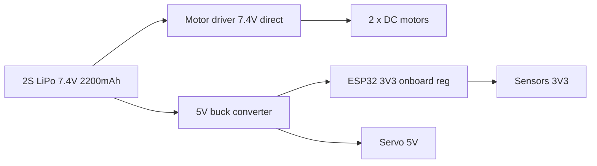

A battery is a fuel tank, and like any fuel tank you need to know how big it is, how fast you can pour out of it, and how much your engine drinks.

The three numbers on every pack

|Number|Means|Example|
|---|---|---|
|Voltage (V)|The pressure it supplies. Set by the chemistry and how many cells are in series|11.1V = 3 LiPo cells in series ("3S")|
|Capacity (mAh)|How much charge it holds. 2200mAh means it can supply 2200mA for one hour, or 1100mA for two|2200mAh|
|C rating|How fast it's allowed to be drained. Max current = C × capacity in amps|25C on 2.2Ah = 55A|

mAh in plain terms: milliamp-hours. Multiply your average draw in mA by hours and it has to come out under the capacity. That's the whole idea.

C rating worked out

A 2200mAh 25C LiPo:

2200mAh = 2.2Ah

Max continuous current = 25 × 2.2 = 55A

Pull more than that and it overheats, swells, and with lithium that ends badly. Cheap packs also lie about their C rating, so treat the printed number as optimistic.

Voltage sag

Every battery has internal resistance, a small resistance built into the cell itself. Draw current through it and Ohm's law takes a bite out of the voltage you actually get at the terminals. It's the fuel tank equivalent of the pipe being narrow, the harder you pull, the less pressure comes out.

Worked example

A pack with 0.1Ω internal resistance, nominally 7.4V, and your motors suddenly demand 5A.

Voltage lost inside the battery = I × R = 5 × 0.1 = 0.5V

Terminal voltage = 7.4 − 0.5 = 6.9V

Half a volt gone the moment the motors start. If your 5V regulator needs at least 6.5V in to work, you're now one more amp away from a brownout, and the microcontroller resets. This is why a robot that runs perfectly on a bench power supply keeps rebooting on battery.

Old or cold packs have much higher internal resistance, which is why an old battery still reads full voltage sitting still and collapses under load.

Chemistries

|Type|Nominal V per cell|Full / empty|Good|Bad|
|---|---|---|---|---|
|LiPo|3.7V|4.2V / 3.0V|Huge current, light, rechargeable|Needs a balance charger, fire risk if abused, never discharge below 3.0V per cell|
|Li-ion (18650)|3.7V|4.2V / 2.8V|High capacity, robust, cheap per Wh|Heavier, lower current than LiPo|
|NiMH|1.2V|1.4V / 1.0V|Safe, tolerant of abuse, good current|Self-discharges, heavier, 1.2V per cell is awkward|
|Alkaline|1.5V|1.5V / 0.9V|Everywhere, cheap|High internal resistance so it sags badly under motor loads, not rechargeable. Fine for a clock, useless for a robot|

Note the difference between nominal and full. A "11.1V" 3S LiPo is actually 12.6V fresh off the charger and 9V when empty. Your regulator has to cope with that whole range, and your motor gets noticeably slower as the pack drains.

Worked example, budgeting a robot's runtime

A two-wheel robot on a 2S LiPo (7.4V, 2200mAh):

|Part|Average current|
|---|---|
|ESP32 with WiFi on|150mA|
|2 × geared DC motors, driving around|2 × 400mA = 800mA|
|Servo for the sensor head|200mA|
|Ultrasonic + IMU + LEDs|50mA|
|Total|1200mA|

Runtime = capacity / draw = 2200mAh / 1200mA = 1.83 hours

Now derate it. You never want to pull a LiPo below about 20% left, and average draw is always higher than your neat estimate because of startup surges and stalls:

Usable = 1.83 × 0.8 = 1.46 hours, call it about 1 hour 20 minutes.

Then sanity-check the peak, not just the average. Both motors stalled at 2A each plus everything else is about 4.4A. On a 2200mAh 25C pack that's well under the 55A limit, so the pack is fine, but check your motor driver and your wiring are happy with 4.4A too.

Power tree for that robot

Feed motors straight from the battery and give logic its own regulated rail. If they share a rail, every motor surge drags your logic voltage down with it.

Why you care when wiring a robot

Budget for peak current, not average, or you'll brown out on the first hard turn.

Watch voltage sag rather than just resting voltage. A battery that reads 7.8V idle and 6.4V under load is worn out.

Alkalines look convenient and will disappoint you the moment a motor is involved.

Always join the motor battery ground and the logic ground together at a single point, otherwise your signals have no shared reference. See [[Voltage, Current and Resistance]].

Bulk capacitance across the motor supply absorbs surges the battery can't respond to fast enough. See [[Capacitance and RC timing]].
