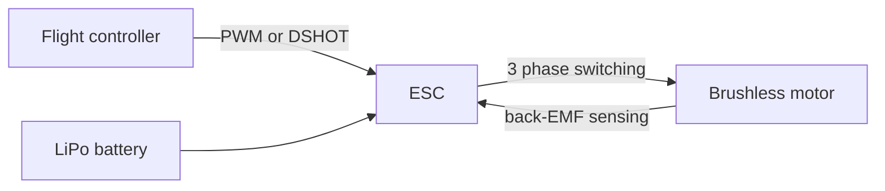

A motor is nothing more than magnets pushing each other around in a circle, with electricity deciding when to flip the pushing.

Current makes magnetism

Run current through a straight wire and a magnetic field wraps around it in circles. It's weak. Wind that wire into a coil and all those little fields line up and add together, and now you have an electromagnet with a north and a south end just like a fridge magnet. Add an iron core in the middle and it gets much stronger again.

Two things follow, and they're the whole of motors and generators:

More current means a stronger field. Turn the current off and the field vanishes. Reverse the current and north and south swap over.

The motor effect

Put a current-carrying wire in a magnetic field and the wire feels a sideways push. It's not pushed along the field or along the current, it's pushed at right angles to both. You don't need the vector maths, you just need to know that current + magnetic field = force, and that reversing either one reverses the force.

Stick that pushed wire on a shaft and it wants to rotate. That's a motor.

Do it backwards, physically spin the shaft, and moving the wire through the field pushes current along it instead. That's a generator. Every motor is also a generator, which matters a lot in a minute.

Brushed DC motors

The problem with a spinning coil is that after half a turn it's facing the wrong way and the force would now push it backwards. Brushed motors solve this mechanically. A split ring called the commutator, with two sprung carbon brushes rubbing on it, physically reverses the current in the coil twice per revolution, so the push is always in the same direction.

|Good|Bad|
|---|---|
|Dirt cheap|Brushes wear out|
|Two wires, no electronics needed|Constant sparking makes electrical noise|
|Reverse it by swapping the two wires|Less efficient, gets hotter|
|Speed control is just PWM through an H-bridge|Not great at low speed|

Brushless motors (BLDC)

Same physics, but the switching is done electronically instead of by rubbing contacts. The magnets are on the rotor, the coils are fixed to the housing, and a controller energises the three coil groups in sequence to drag the magnets round. No brushes to wear, no sparking, much more efficient, which is why every drone uses them.

The controller is called an ESC (electronic speed controller). It needs to know where the rotor currently is to know which coil to fire next, and it works that out either from hall-effect sensors or, in cheap drone ESCs, by measuring the back-EMF on whichever coil isn't being driven at that instant.

Back-EMF and why stalling kills things

As soon as a motor spins, it's also acting as a generator, producing a voltage that opposes the supply. That's back-EMF again, and here it's genuinely useful: back-EMF is roughly proportional to speed, so the faster the motor spins, the more it fights the supply, and the less current it draws.

Worked example

A small brushed motor with 2Ω of winding resistance, running from 6V.

Stalled (shaft held still, no spin, so no back-EMF):

I = V / R = 6 / 2 = 3A

Free running at full speed, generating say 5V of back-EMF. The supply only has to overcome the difference:

I = (6 − 5) / 2 = 1 / 2 = 0.5A

So the same motor pulls 0.5A spinning freely and 3A when jammed, six times as much. Power wasted as heat when stalled is P = I² × R = 9 × 2 = 18W in a motor the size of your thumb. It cooks in seconds, and the driver chip usually goes first.

This is why datasheets quote a stall current, and why you size your motor driver and battery for stall, not for the nice number.

A useful trick falls out of this: if you know the supply voltage and measure the current, you can estimate the motor's speed and load with no encoder at all. Current going up means the motor is being loaded, which is how "sense the robot has hit a wall" works without a bump sensor.

Why you care when wiring a robot

Pick a driver rated above the motor's stall current, not its running current.

Free-running motor specs are optimistic. A drivetrain under load draws several times more.

Motors are inductive, so everything in [[Inductance and Back-EMF]] applies: flyback diodes, decoupling caps, and a separate power path from your logic.
