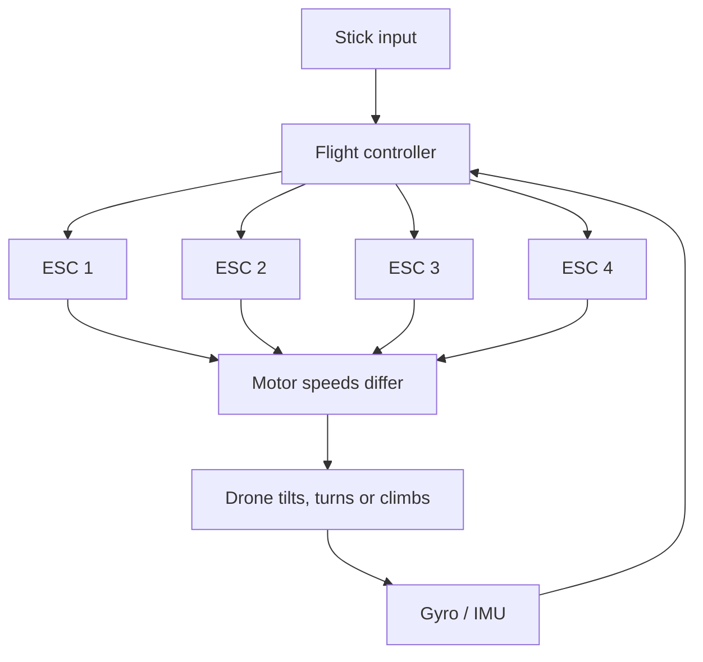

A quadcopter has no moving control surfaces at all, it flies entirely by making four propellers spin at slightly different speeds.

How a prop makes thrust

A propeller is a spinning wing. As it turns, its angled blades grab air from above and hurl it downwards. Newton's third law does the rest: the prop pushed the air down, so the air pushes the prop up. That upward push is thrust. See [[Forces and Newton's Laws]].

That's really all there is to it at hobby level. More air, thrown down faster, means more thrust. You get more air by using a bigger prop, and you throw it faster by spinning harder or using more blade pitch.

|Change|Effect|
|---|---|
|Bigger diameter prop|Much more thrust, more efficient, slower to respond|
|More pitch (steeper blade angle)|More thrust and speed, much more current draw|
|More RPM|More thrust, roughly with the square of RPM|
|More blades|Slightly more thrust, more drag, less efficient|

Thrust is quoted in grams (technically grams-force) because it's directly comparable to the drone's weight, which is the number you actually care about.

Thrust-to-weight ratio

TWR = total thrust from all motors at full throttle / all-up weight

All-up weight (AUW) means everything: frame, battery, camera, props, the lot.

Worked example

A 5" quad, 800g all-up, with motor and prop combo tested at 600g of thrust each.

Total thrust = 4 × 600 = 2400g

TWR = 2400 / 800 = 3:1

At 3:1, hovering takes roughly a third of full throttle, so the hover point sits around 33% on the stick. That leaves loads of headroom to climb and correct.

|TWR|Feel|
|---|---|
|Below 1.5:1|Will barely lift, no control authority, dangerous|
|2:1|Minimum sensible, fine for a camera or cargo drone|
|2.5 to 3:1|Comfortable, responsive, good all-rounder|
|5:1 and up|Racing and freestyle, violently fast|

Below 1:1 it simply cannot leave the ground, because the thrust doesn't beat gravity.

The four motor layout

Motors are numbered and, crucially, they don't all spin the same way. Diagonal pairs spin together.

```
        FRONT

   M4 ↺        M1 ↻
     \        /
      \      /
       [  FC  ]
      /      \
     /        \
   M3 ↻        M2 ↺

        REAR

   ↻ = clockwise   ↺ = counter-clockwise
   M1/M3 one direction, M2/M4 the other
```

The opposite spin directions are not cosmetic. A spinning motor twists the frame the opposite way (third law again). If all four spun the same way, the whole drone would spin uncontrollably. With two going each way, the twists cancel out and the drone sits still.

How the three axes work



|You want|The flight controller does|Why it works|
|---|---|---|
|Climb (throttle)|Speed up all four equally|Total thrust exceeds weight|
|Pitch forward|Speed up the two rear motors, slow the two front|Nose drops, total thrust now tilts forward and pushes the drone along|
|Roll right|Speed up the two left motors, slow the two right|Tilts right, thrust pushes it sideways|
|Yaw right|Speed up the counter-clockwise pair, slow the clockwise pair|Total thrust stays the same so it doesn't climb, but the twist reactions no longer cancel, so the frame rotates|

Yaw is the clever one. It doesn't use aerodynamics at all, it deliberately unbalances the reaction torques that the spin directions were cancelling out.

Notice that a quad can't move sideways without tilting first. Forward flight is just a tilted hover, where part of the thrust holds it up and part pushes it along, which is why you need a bit more throttle when flying fast.

Why it needs a computer

A quadcopter is not stable on its own. Any tiny imbalance tips it, and once it's tipped it accelerates in that direction and tips further. The flight controller reads the gyro hundreds of times a second and nudges the motors to correct, which is a closed feedback loop, see [[Feedback and PID control]].

Why you care when building

Weigh the whole thing and look up real thrust data for your motor and prop combo, don't guess. Aim for at least 2:1.

Prop direction and motor order must match what the flight controller expects, or it corrects the wrong way and flips on takeoff. This is the classic first-flight failure.

Bigger props respond more slowly because of their inertia, see [[Rotational motion and Inertia]].

Full-throttle current draw is huge, often 20-40A per motor on a 5" quad, which is why drones use LiPos with high C ratings, see [[Batteries and Power budgets]].
