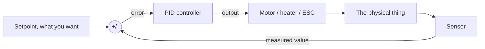

PID is how you make a machine hold a target it can't hit perfectly first time, and it's the single most useful control idea in robotics.

Open loop versus closed loop

Open loop means you send a command and hope. A toaster runs the element for 3 minutes whether the bread is browning or burning, because it never checks. Setting your motor to 60% PWM and assuming that means a certain speed is open loop, and it stops being true the moment the robot hits a ramp or the battery sags.

Closed loop means you measure the result and keep correcting. An oven with a thermostat measures the actual temperature and switches the element on or off to keep it at the target. Nothing needs calibrating, because it's constantly checking.



That subtraction at the front is the whole trick. Error = setpoint minus measured. PID's only job is turning that one number into an output.

What P, I and D each physically do

output = Kp × error + Ki × (sum of error over time) + Kd × (how fast error is changing)

Three terms, each answering a different question.

|Term|Looks at|Physically|Too little|Too much|
|---|---|---|---|---|
|P, proportional|How far off you are right now|Push harder the further away you are|Slow, sluggish, weak|Overshoots and oscillates|
|I, integral|How long you've been off for|Notices a small error that won't go away and keeps piling on effort until it does|Never quite reaches the target, settles slightly short|Slow wobbling, big overshoot after a change|
|D, derivative|How fast you're closing in|Brakes as you approach so you don't sail past|Overshoots|Jittery, twitchy, amplifies sensor noise badly|

The intuitive picture is a car and a stop line. P is pressing the accelerator harder the further away the line is. I is noticing you've been sitting 2 metres short for a while and giving it a bit more. D is easing off as the line rushes up so you stop on it rather than past it.

P alone leaves steady-state error: as you approach the target the error shrinks, so the push shrinks, and something like friction or gravity stops you just short. I exists specifically to kill that leftover gap.

A PID in code

```cpp
struct PID
{
    float kp, ki, kd;

    float integral   = 0.0f;
    float prevError  = 0.0f;

    float outMin = -255.0f;   // matches an 8-bit PWM range
    float outMax =  255.0f;
};

float pidUpdate(PID &p, float setpoint, float measured, float dt)
{
    float error = setpoint - measured;

    // P: react to how far off we are now
    float pTerm = p.kp * error;

    // I: accumulate the error over time, clamped so it can't run away
    p.integral += error * dt;

    if (p.integral >  1000.0f) p.integral =  1000.0f;
    if (p.integral < -1000.0f) p.integral = -1000.0f;

    float iTerm = p.ki * p.integral;

    // D: how fast the error is changing, i.e. are we closing in too quickly
    float dTerm = p.kd * (error - p.prevError) / dt;

    p.prevError = error;

    float out = pTerm + iTerm + dTerm;

    if (out > p.outMax) out = p.outMax;
    if (out < p.outMin) out = p.outMin;

    return out;
}
```

Calling it at a fixed rate, which matters more than people expect:

```cpp
PID  balance = { 12.0f, 0.5f, 0.8f };   // kp, ki, kd

const unsigned long INTERVAL_MS = 10;   // 100 Hz
unsigned long lastRun = 0;

void loop()
{
    unsigned long now = millis();

    if (now - lastRun >= INTERVAL_MS)
    {
        float dt = (now - lastRun) / 1000.0f;   // seconds
        lastRun = now;

        float angle  = readAngleFromIMU();
        float output = pidUpdate(balance, 0.0f, angle, dt);   // target is upright

        driveMotors(output);
    }
}
```

Two things in there matter as much as the maths. The integral clamp stops integral windup, where the term piles up hugely while the output is already maxed out and then takes ages to unwind, giving you a massive overshoot. And the fixed interval keeps dt meaningful, because a jittery loop time makes the D term especially garbage.

Tuning, in plain language

Set Ki and Kd to zero. Only P for now.

Raise Kp until the system responds briskly and just starts to oscillate around the target, then back it off to about half or two thirds of that.

Add Kd slowly. It should damp the overshoot and settle it faster. When it starts sounding buzzy or the motors get twitchy, you've gone too far, because D amplifies sensor noise. Filter your input signal first, see [[Noise and Filtering]].

Add Ki last, and keep it small. It removes the remaining gap between where it settles and where you asked for. Too much and you get a slow wallowing oscillation.

Change one gain at a time and log what happens. Plot the measured value against the setpoint over time, because you cannot tune what you cannot see.

|Symptom|Likely cause|
|---|---|
|Slow to reach target|Kp too low|
|Oscillates fast around target|Kp too high|
|Overshoots then settles|Needs more Kd|
|Jittery, buzzing motors|Kd too high, or noisy input|
|Settles slightly off target|Needs some Ki|
|Slow wallowing back and forth|Ki too high|
|Big overshoot after a large change|Integral windup, clamp it|

You often don't need all three. PD is normal for drone attitude, PI is normal for motor speed, and plain P is fine for a line follower.

Where you'll actually use it

|Project|Setpoint|Measured|Output|
|---|---|---|---|
|Self-balancing robot|Upright, 0°|IMU tilt angle|Motor drive, see [[Centre of mass and Stability]]|
|Drone attitude|Stick position|Gyro rate|Per-motor speed, see [[Thrust, Lift and how Drones fly]]|
|Line follower|Line centred|Sensor array position|Difference between left and right wheel speed|
|Motor speed hold|Target rpm|Encoder count|PWM duty|
|Temperature control|Target °C|Thermistor|Heater duty cycle|

Why you care when building

Any time "just set it to 60%" stops working because the load changes, you need a closed loop.

Lag anywhere in the loop causes oscillation: a heavy filter, a slow sensor, or a chunky loop interval all count. See [[Noise and Filtering]].

Gains are not universal. They depend on the mass, inertia, gearing and sensor of your specific machine, so a tune from someone else's build is a starting point at best, see [[Rotational motion and Inertia]].

---

**Going deeper:** [[PID and Kalman filters]] - the formulas, tuning procedure, and integral windup.
