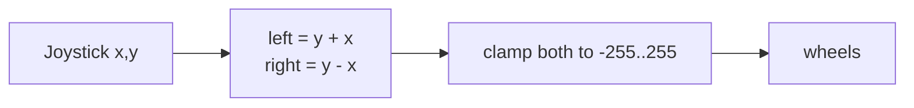

The same chassis, driven from your phone over Bluetooth. Tank-style steering from a couple of on-screen joysticks or plain letter commands.

What you'll learn

- Bluetooth Serial as a wireless replacement for the USB cable
- Designing a command protocol you can debug by typing
- Failsafes — what happens when the phone walks out of range
- Mixing throttle and steering into two wheel speeds

Parts

|Part|Qty|Rough price|Already own?|
|---|---|---|---|
|The robot chassis|1|—|From the previous builds|
|L298N + 2 motors + battery|1|—|Already built|
|An Android phone|1|—|Yes|

No new hardware at all. The radio is already inside the ESP32.

Android note: use the **Serial Bluetooth Terminal** app (free) — it pairs with Bluetooth Classic and lets you type commands or bind them to buttons. iPhone can't do Bluetooth Classic SPP at all; if you're on iOS you need BLE instead, which is mentioned at the end.

Wiring

Unchanged from [[Line following robot]] — motors only, sensors optional.

```
        ESP32                       L298N
     ┌──────────┐              ┌─────────────┐
     │  GPIO14  ├──────────────┤ ENA         ├── OUT1 ─┐  LEFT
     │  GPIO27  ├──────────────┤ IN1         ├── OUT2 ─┘  MOTOR
     │  GPIO26  ├──────────────┤ IN2         │
     │  GPIO32  ├──────────────┤ ENB         ├── OUT3 ─┐  RIGHT
     │  GPIO25  ├──────────────┤ IN3         ├── OUT4 ─┘  MOTOR
     │  GPIO33  ├──────────────┤ IN4         │
     │  GND     ├──────────────┤ GND         │
     └──────────┘              │ +12V ───── BATTERY 6V
                               └─────────────┘
```

|From|To|Note|
|---|---|---|
|ESP32 GPIO14 / 27 / 26|L298N ENA / IN1 / IN2|left motor|
|ESP32 GPIO32 / 25 / 33|L298N ENB / IN3 / IN4|right motor|
|L298N GND|ESP32 GND|**mandatory** common ground|
|Battery + / −|L298N +12V / GND|motor supply|
|L298N OUT1-4|Motor terminals|swap a pair if a wheel runs backwards|

Once it's untethered you need the ESP32 on battery too. Either enable the L298N's 5V regulator jumper and feed the ESP32's VIN pin from it (accepting the brownout risk on stalls), or give the ESP32 its own USB power bank. The power bank is more reliable. Either way, grounds stay joined. See [[Batteries and Power budgets]].

How it works

The ESP32's radio does WiFi *and* Bluetooth. `BluetoothSerial` gives you Bluetooth Classic SPP, which behaves exactly like the USB serial port you've been printing to — same `available()`, `read()`, `println()`. That's the whole appeal: you can develop over USB and switch to wireless by changing one object. More in [[Bluetooth (ESP32)]].

Important: WiFi and Bluetooth Classic share one antenna and a lot of RAM. Running both at once mostly works but is flaky, and the combined binary may not fit the default partition. Pick one for now.

The command protocol is deliberately human-typable so you can debug it from a terminal app:

|Command|Meaning|
|---|---|
|`F`|Forward|
|`B`|Backward|
|`L` / `R`|Spin left / right|
|`S`|Stop|
|`0`-`9`|Speed, 0 slowest to 9 fastest|
|`Jx,y`|Joystick: x and y from -100 to 100|

Then there's the part beginners always skip: the **failsafe**. If the phone disconnects, or you walk out of range, or the app is backgrounded mid-command, the last command keeps executing forever and the car drives into a wall at full speed. So the car stops on its own if it hasn't heard anything for 500ms. Any vehicle you control remotely needs this, and it becomes a genuine safety requirement by the time you get to [[Quadcopter flight controller]].

The joystick mix is the standard tank/arcade mix:



Push forward, both wheels get positive. Push right, x adds to the left and subtracts from the right, so it curves. Push right with no forward, it spins in place.

Code

```cpp
/*
1. BluetoothSerial behaves exactly like the USB Serial object
2. single-letter commands for buttons, Jx,y for a joystick
3. lastCommand timestamps every packet we receive
4. if 500ms passes with no packet, we stop - the failsafe
5. the arcade mix turns one x/y pair into two wheel speeds
*/

#include "BluetoothSerial.h"

BluetoothSerial BT;

const int ENA = 14, IN1 = 27, IN2 = 26;   // left
const int ENB = 32, IN3 = 25, IN4 = 33;   // right

int speedLevel = 200;                     // 0-255, set by digits 0-9
unsigned long lastCommand = 0;
const unsigned long FAILSAFE_MS = 500;    // stop if we go this long unheard
bool stopped = true;

void driveLeft(int s) {
  s = constrain(s, -255, 255);
  digitalWrite(IN1, s >= 0); digitalWrite(IN2, s < 0);
  ledcWrite(ENA, abs(s));
}
void driveRight(int s) {
  s = constrain(s, -255, 255);
  digitalWrite(IN3, s >= 0); digitalWrite(IN4, s < 0);
  ledcWrite(ENB, abs(s));
}

void drive(int left, int right) {
  driveLeft(left);
  driveRight(right);
  stopped = (left == 0 && right == 0);
}

// arcade mix: one stick position -> two wheel speeds
void joystick(int x, int y) {
  int fwd  = map(constrain(y, -100, 100), -100, 100, -255, 255);
  int turn = map(constrain(x, -100, 100), -100, 100, -255, 255);

  drive(constrain(fwd + turn, -255, 255),
        constrain(fwd - turn, -255, 255));
}

void handle(String cmd) {
  cmd.trim();
  if (cmd.length() == 0) return;

  lastCommand = millis();          // any valid packet resets the failsafe

  char c = cmd.charAt(0);

  if (c == 'J') {                  // "J-40,80"
    int comma = cmd.indexOf(',');
    if (comma > 1) {
      int x = cmd.substring(1, comma).toInt();
      int y = cmd.substring(comma + 1).toInt();
      joystick(x, y);
    }
    return;
  }

  if (c >= '0' && c <= '9') {      // speed preset
    speedLevel = map(c - '0', 0, 9, 80, 255);
    BT.printf("speed %d\n", speedLevel);
    return;
  }

  switch (toupper(c)) {
    case 'F': drive( speedLevel,  speedLevel); break;
    case 'B': drive(-speedLevel, -speedLevel); break;
    case 'L': drive(-speedLevel,  speedLevel); break;   // spin on the spot
    case 'R': drive( speedLevel, -speedLevel); break;
    case 'S': drive(0, 0);                     break;
    default:  BT.println("unknown command");   break;
  }
}

void setup() {
  Serial.begin(115200);

  pinMode(IN1, OUTPUT); pinMode(IN2, OUTPUT);
  pinMode(IN3, OUTPUT); pinMode(IN4, OUTPUT);

  ledcAttach(ENA, 1000, 8);
  ledcAttach(ENB, 1000, 8);

  drive(0, 0);

  BT.begin("ESP32-Car");           // this name appears in your phone's pairing list
  Serial.println("pair with ESP32-Car");
}

void loop() {
  // read a whole line at a time
  if (BT.available()) {
    String line = BT.readStringUntil('\n');
    handle(line);
  }

  // also accept commands over USB, handy for testing without a phone
  if (Serial.available()) {
    handle(Serial.readStringUntil('\n'));
  }

  // FAILSAFE: heard nothing recently, so stop
  if (!stopped && millis() - lastCommand > FAILSAFE_MS) {
    drive(0, 0);
    Serial.println("failsafe: signal lost, stopping");
  }
}
```

If the app sends continuous joystick packets this works nicely. If it sends one letter per button *press* with nothing while held, the failsafe will cut you off after half a second — either set the app to repeat, or raise `FAILSAFE_MS`. Don't remove it.

Make it better

- Add headlights that come on with a `H` command, and a buzzer horn
- Report battery voltage back over Bluetooth using a [[Voltage dividers]] on the pack
- Keep the ultrasonic sensor active as a collision override that ignores your forward command
- Switch to BLE (`BLEDevice` / `NimBLE`) so iOS can connect and so it uses far less power
- Add an autonomous button that hands over to the [[Obstacle avoiding robot]] logic
