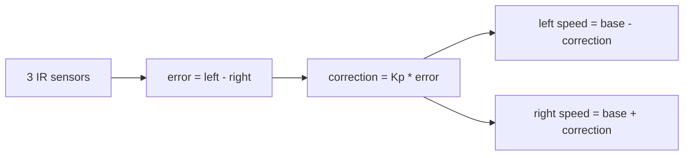

A two-wheeled robot that follows a black line on white paper using IR reflectance sensors. Your first autonomous machine.

What you'll learn

- Differential drive — steering by making one wheel turn faster
- Reading the world with reflected infrared
- Proportional control, the gentlest introduction to PID
- Calibration, and why hardcoded thresholds always fail

Parts

|Part|Qty|Rough price|Already own?|
|---|---|---|---|
|ESP32 dev board|1|£8|Yes|
|L298N motor driver|1|£4|From the last project|
|TT gear motors + wheels|2|£6|No|
|2WD chassis kit (or cardboard)|1|£8|No|
|Caster / ball wheel|1|included|No|
|TCRT5000 IR sensor module|3|£3|No|
|4×AA battery holder|1|£3|No|
|Black electrical tape + white card|1|£3|No|

A "2WD smart car chassis" on eBay is about £10 and includes the plate, two motors, wheels, caster and battery box. Buying separately costs more.

Wiring

```
  BATTERY 6V ─┬─── L298N +12V
              │
              └─── (ESP32 stays on USB while testing)

        ESP32                       L298N
     ┌──────────┐              ┌────────────┐
     │  GPIO14  ├──────────────┤ ENA        │
     │  GPIO27  ├──────────────┤ IN1        ├── OUT1 ─┐  LEFT
     │  GPIO26  ├──────────────┤ IN2        ├── OUT2 ─┘  MOTOR
     │  GPIO25  ├──────────────┤ IN3        ├── OUT3 ─┐  RIGHT
     │  GPIO33  ├──────────────┤ IN4        ├── OUT4 ─┘  MOTOR
     │  GPIO32  ├──────────────┤ ENB        │
     │  GND     ├──────────────┤ GND        │
     └────┬─────┘              └────────────┘
          │
          │      IR sensor array, pointing down at the floor
          │   ┌────────┬────────┬────────┐
          │   │  LEFT  │ CENTRE │ RIGHT  │
          │   └───┬────┴───┬────┴───┬────┘
          │       │        │        │
          │    GPIO35   GPIO34   GPIO39     analog out (ADC1 only)
          │       │        │        │
          └───────┴────────┴────────┘  all VCC->3V3, all GND->GND rail
```

|From|To|Note|
|---|---|---|
|Battery +/−|L298N +12V / GND|motor power|
|L298N GND|ESP32 GND|**mandatory** common ground|
|ESP32 GPIO14 / 27 / 26|L298N ENA / IN1 / IN2|left motor: speed, dir, dir|
|ESP32 GPIO32 / 25 / 33|L298N ENB / IN3 / IN4|right motor: speed, dir, dir|
|L298N OUT1, OUT2|Left motor terminals|swap if it drives backwards|
|L298N OUT3, OUT4|Right motor terminals|swap if it drives backwards|
|IR sensor VCC ×3|ESP32 3V3|**3.3V, not 5V**|
|IR sensor GND ×3|GND rail|common ground|
|Left sensor AO|ESP32 GPIO35|ADC1|
|Centre sensor AO|ESP32 GPIO34|ADC1|
|Right sensor AO|ESP32 GPIO39|ADC1|

Power the IR modules from **3V3**. Powered from 5V, their analog output can swing to 5V and that will damage the ADC pin. If you must run them at 5V, put a [[Voltage dividers]] on each output first.

GPIO34/35/39 are ADC1 and input-only, which is exactly what we want. Don't use GPIO0, 2, 12 or 15 for the motor pins — they're strapping pins and holding them at the wrong level at boot stops the board starting.

Sensor spacing matters more than the code: mount them 5-10mm above the floor and spaced so the outer two sit just outside a 19mm tape line while the centre is on it.

How it works

Each TCRT5000 is an IR LED pointing at the floor next to a phototransistor. White card reflects a lot of IR, so the phototransistor conducts and the analog output goes low. Black tape absorbs it, so the output stays high. You get a number roughly proportional to how black the floor is under that sensor. Background in [[Sensors overview]].

Steering is differential — there's no steering mechanism at all. Both wheels equal = straight. Left wheel slower = turns left. That's all a two-wheel robot ever does, and it's why the caster is just a passive ball. Relevant physics in [[Friction, Traction and Robot movement]].

The control idea: compute an **error** for how far off-line you are (negative = drifted right, positive = drifted left), then subtract it from one motor and add it to the other. That's proportional control — correction proportional to error. The gain `Kp` decides how hard it reacts:

|Kp|Behaviour|
|---|---|
|Too low|Drifts wide on corners and loses the line|
|Right|Follows smoothly with a gentle weave|
|Too high|Violent zigzagging, oscillates itself off the line|

Tuning Kp by watching it wobble is exactly the intuition you need for [[Feedback and PID control]], which the balancing robot will demand properly.



Calibration is not optional. Sensor readings change with ambient light, floor colour, battery voltage and sensor height. A threshold that worked in your kitchen fails in daylight. So we measure white and black at startup and normalise against that.

Code

```cpp
/*
1. calibrate() records the min and max each sensor sees, so we work in 0-1000
2. error is a weighted position: negative means we've drifted right
3. correction = Kp * error, added to one wheel and subtracted from the other
4. if all sensors go white we've lost the line, so we spin the way we last saw it
5. everything is proportional only, no I or D term yet
*/

// --- motors ---
const int ENA = 14, IN1 = 27, IN2 = 26;   // left
const int ENB = 32, IN3 = 25, IN4 = 33;   // right

// --- sensors, all ADC1 ---
const int S_LEFT = 35, S_CENTRE = 34, S_RIGHT = 39;

const int BASE_SPEED = 150;   // 0-255, start slow while tuning
const float Kp = 0.35;        // the number you'll spend all your time on

int minVal[3] = {4095, 4095, 4095};
int maxVal[3] = {0, 0, 0};
int lastError = 0;

void driveLeft(int speed) {
  speed = constrain(speed, -255, 255);
  digitalWrite(IN1, speed >= 0);
  digitalWrite(IN2, speed <  0);
  ledcWrite(ENA, abs(speed));
}

void driveRight(int speed) {
  speed = constrain(speed, -255, 255);
  digitalWrite(IN3, speed >= 0);
  digitalWrite(IN4, speed <  0);
  ledcWrite(ENB, abs(speed));
}

void stop() { driveLeft(0); driveRight(0); }

// returns 0 (pure white) to 1000 (pure black) for one sensor
int normalised(int pin, int i) {
  int raw = analogRead(pin);
  int span = maxVal[i] - minVal[i];
  if (span < 50) return 0;                        // sensor never saw contrast
  return constrain(map(raw, minVal[i], maxVal[i], 0, 1000), 0, 1000);
}

// sweep the robot over the line for 4 seconds, learning white and black
void calibrate() {
  Serial.println("calibrating, sweep me across the line");

  unsigned long start = millis();
  int pins[3] = {S_LEFT, S_CENTRE, S_RIGHT};

  while (millis() - start < 4000) {
    // wiggle so every sensor sees both tape and card
    int dir = ((millis() - start) / 500) % 2 ? 120 : -120;
    driveLeft(dir);
    driveRight(-dir);

    for (int i = 0; i < 3; i++) {
      int v = analogRead(pins[i]);
      if (v < minVal[i]) minVal[i] = v;
      if (v > maxVal[i]) maxVal[i] = v;
    }
    delay(5);
  }

  stop();

  for (int i = 0; i < 3; i++) {
    Serial.printf("sensor %d: min %d max %d\n", i, minVal[i], maxVal[i]);
  }
}

void setup() {
  Serial.begin(115200);

  pinMode(IN1, OUTPUT); pinMode(IN2, OUTPUT);
  pinMode(IN3, OUTPUT); pinMode(IN4, OUTPUT);

  ledcAttach(ENA, 1000, 8);
  ledcAttach(ENB, 1000, 8);

  stop();
  delay(1500);              // time to put it down and step back
  calibrate();
  delay(1000);
}

void loop() {
  int l = normalised(S_LEFT,   0);
  int c = normalised(S_CENTRE, 1);
  int r = normalised(S_RIGHT,  2);

  int total = l + c + r;

  if (total < 150) {
    // no black anywhere: line lost. spin toward wherever it went
    int spin = (lastError > 0) ? 140 : -140;
    driveLeft(spin);
    driveRight(-spin);
    return;
  }

  // positive error = more black on the left = we've drifted right
  int error = (l - r);
  lastError = error;

  int correction = (int)(Kp * error);

  driveLeft(BASE_SPEED  - correction);
  driveRight(BASE_SPEED + correction);
}
```

Tuning routine: set `BASE_SPEED` low (120) and `Kp` low. Raise `Kp` until it zigzags, then back off ~30%. Only then raise the speed — and expect to raise `Kp` again when you do, because a faster robot has less time to correct.

Make it better

- Add the D term: `correction = Kp*error + Kd*(error - lastError)` kills the zigzag and lets you go much faster
- Use five sensors and a weighted position (`-2,-1,0,1,2`) for a far smoother error signal
- Detect a thick perpendicular line as a finish marker and stop on it
- Log error over time to the [[WiFi sensor dashboard]] and tune by looking at a graph instead of guessing
- Add the ultrasonic sensor and stop when something blocks the track — leads into [[Obstacle avoiding robot]]
