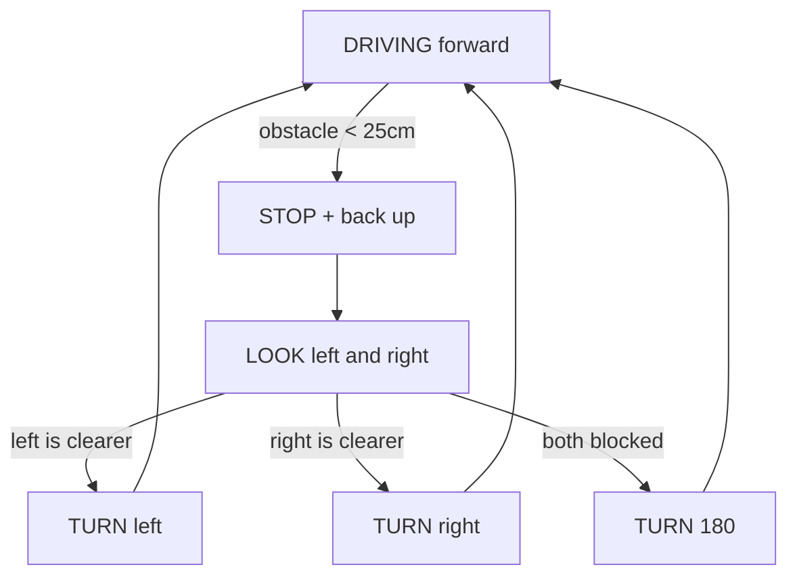

The same chassis, but now it drives around freely and steers away from whatever it bumps into. No line to follow — it decides for itself.

What you'll learn

- Combining a servo, a sensor and two motors into one behaviour
- Behaviour-based robotics: a state machine that picks what to do next
- Why a blocking sensor read ruins a moving robot
- That a 15° ultrasonic cone is nowhere near enough to see everything

Parts

|Part|Qty|Rough price|Already own?|
|---|---|---|---|
|The line-follower chassis|1|—|From the last project|
|HC-SR04 ultrasonic sensor|1|£2|From the distance project|
|SG90 servo|1|£3|From the servo project|
|1kΩ + 2kΩ resistors|1 each|£0.10|Yes|
|Servo bracket for the HC-SR04|1|£2|No, but tape works|

Wiring

```
        ESP32                       L298N
     ┌──────────┐              ┌────────────┐
     │  GPIO14  ├──────────────┤ ENA  IN1 IN2├── left motor
     │  GPIO27  ├──────────────┤            │
     │  GPIO26  ├──────────────┤            │
     │  GPIO32  ├──────────────┤ ENB  IN3 IN4├── right motor
     │  GPIO25  ├──────────────┤            │
     │  GPIO33  ├──────────────┤            │
     │  GND     ├──────────────┤ GND        │
     └────┬─────┘              └────────────┘
          │
          │   ┌──────────────┐
          │   │   HC-SR04    │   on the servo, facing forward
          │   │ VCC TRG ECH GND
          │   └──┬───┬───┬──┬┘
          │      │   │   │  │
          │      │   │   │  └──── GND rail
          │      │   │   │
          │      │   │   └──[1kΩ]──┬──── ESP32 GPIO18   ECHO divided
          │      │   │             │
          │      │   │           [2kΩ]
          │      │   │             │
          │      │   │            GND
          │      │   └──────────────── ESP32 GPIO5      TRIG
          │      └──────────────────── 5V rail
          │
          └───── ESP32 GPIO13 ──────── servo signal
                 servo red -> 5V rail, servo brown -> GND rail
```

|From|To|Note|
|---|---|---|
|Motors / L298N|as [[Line following robot]]|unchanged from the last build|
|HC-SR04 VCC|5V rail|needs 5V|
|HC-SR04 TRIG|ESP32 GPIO5|3.3V is enough to trigger|
|HC-SR04 ECHO|1kΩ → GPIO18, 2kΩ → GND|**divider required, ECHO is 5V**|
|Servo signal (orange)|ESP32 GPIO13|50Hz pulse|
|Servo red|5V rail|not from an ESP32 pin|
|Servo brown|GND rail|—|
|All grounds|one GND rail|**every ground joins, always**|

Two repeats worth repeating: the ECHO divider is what stops 5V reaching a 3.3V pin, and the servo must not be powered from the ESP32. A servo drawing 500mA through the board's regulator browns it out mid-turn.

How it works

The robot runs a behaviour state machine. It only has a few things it can be doing:



Nothing here is new hardware — it's [[Ultrasonic distance sensor]] plus [[Servo sweep and control]] plus [[Driving a DC motor]] glued together with the state pattern from [[Traffic light]]. That's the point: real projects are old parts recombined.

The hard part is timing. `pulseIn` blocks for up to 30ms, and if you scan five servo angles while driving you're blind and out of control for a third of a second. So the code only does the full look-around while **stopped**. While driving it takes a single fast ping straight ahead.

Be realistic about the sensor's limits. The 15° cone misses table legs, chair legs, and anything narrow. It goes completely blind on:

|Situation|What happens|
|---|---|
|Angled wall|Sound bounces away, robot reads "clear" and drives into it|
|Soft furnishing|Absorbed, reads clear|
|Table edge / stair|Sensor points forward, sees nothing, robot drives off|
|Something lower than the sensor|Under the beam entirely|

That's why real robots use several sensor types at once — see [[Sensors overview]]. Add a front bumper microswitch and you catch most of what ultrasound misses, for 20p.

Also: momentum. The robot doesn't stop where you tell it to, it coasts. That's [[Friction, Traction and Robot movement]]. Set your stop distance well beyond the braking distance, or brake actively (both IN pins HIGH) rather than coasting.

Code

```cpp
/*
1. one state variable drives everything, like the traffic light
2. while DRIVING we only ping straight ahead, cheap and fast
3. once stopped we sweep the servo and compare left vs right
4. turns are timed, not measured, so they drift - encoders would fix that
5. every branch ends by going back to DRIVING
*/

#include <ESP32Servo.h>

const int ENA = 14, IN1 = 27, IN2 = 26;   // left motor
const int ENB = 32, IN3 = 25, IN4 = 33;   // right motor
const int TRIG = 5, ECHO = 18;
const int SERVO_PIN = 13;

const int  SPEED       = 150;
const int  TURN_SPEED  = 160;
const float STOP_CM    = 25.0;   // brake well before you'd hit it

Servo head;

enum State { DRIVING, BACKING, LOOKING, TURNING };
State state = DRIVING;

unsigned long stateStart = 0;
int turnDirection = 1;           // 1 = right, -1 = left
unsigned long turnDuration = 400;

void driveLeft(int s) {
  s = constrain(s, -255, 255);
  digitalWrite(IN1, s >= 0); digitalWrite(IN2, s < 0);
  ledcWrite(ENA, abs(s));
}
void driveRight(int s) {
  s = constrain(s, -255, 255);
  digitalWrite(IN3, s >= 0); digitalWrite(IN4, s < 0);
  ledcWrite(ENB, abs(s));
}
void stopMotors() { driveLeft(0); driveRight(0); }

void enter(State s) { state = s; stateStart = millis(); }
unsigned long inState() { return millis() - stateStart; }

// single ping, returns 999 if nothing came back (treat as "clear")
float ping() {
  digitalWrite(TRIG, LOW);  delayMicroseconds(2);
  digitalWrite(TRIG, HIGH); delayMicroseconds(10);
  digitalWrite(TRIG, LOW);

  unsigned long us = pulseIn(ECHO, HIGH, 25000);
  if (us == 0) return 999.0;
  return us / 58.0;
}

// point the head, wait for it to arrive, then measure
float lookAt(int angle) {
  head.write(angle);
  delay(350);                  // servo travel time, only safe while stopped
  return ping();
}

void setup() {
  Serial.begin(115200);

  pinMode(IN1, OUTPUT); pinMode(IN2, OUTPUT);
  pinMode(IN3, OUTPUT); pinMode(IN4, OUTPUT);
  pinMode(TRIG, OUTPUT);
  pinMode(ECHO, INPUT);

  ledcAttach(ENA, 1000, 8);
  ledcAttach(ENB, 1000, 8);

  ESP32PWM::allocateTimer(0);
  head.setPeriodHertz(50);
  head.attach(SERVO_PIN, 500, 2500);
  head.write(90);              // straight ahead

  stopMotors();
  delay(2000);                 // time to put it down
  enter(DRIVING);
}

void loop() {
  switch (state) {

    case DRIVING: {
      driveLeft(SPEED);
      driveRight(SPEED);

      float d = ping();        // one quick look forward
      if (d < STOP_CM) {
        Serial.printf("blocked at %.0f cm\n", d);
        stopMotors();
        enter(BACKING);
      }
      delay(50);               // ~20 pings/sec, the sensor's limit
      break;
    }

    case BACKING: {
      driveLeft(-SPEED);
      driveRight(-SPEED);

      if (inState() > 400) {   // reverse for 0.4s to make room to turn
        stopMotors();
        enter(LOOKING);
      }
      break;
    }

    case LOOKING: {
      // stopped, so it's safe to spend a second sweeping
      float left  = lookAt(150);
      float right = lookAt(30);
      head.write(90);
      delay(200);

      Serial.printf("left %.0f  right %.0f\n", left, right);

      if (left < 30 && right < 30) {
        turnDirection = 1;
        turnDuration  = 900;          // boxed in, spin roughly 180
      } else {
        turnDirection = (left > right) ? -1 : 1;
        turnDuration  = 450;          // roughly 90 degrees
      }

      enter(TURNING);
      break;
    }

    case TURNING: {
      driveLeft(  TURN_SPEED *  turnDirection);
      driveRight(-TURN_SPEED *  turnDirection);   // opposite = spin on the spot

      if (inState() > turnDuration) {
        stopMotors();
        enter(DRIVING);
      }
      break;
    }
  }
}
```

Turn angles are timed, so they depend on battery voltage and floor surface. On carpet at half charge a "90° turn" might be 60°. Encoders or a gyro fix this properly — and the gyro path leads straight into [[Self balancing robot]].

Make it better

- Add two front bumper microswitches on `INPUT_PULLUP` pins to catch what the sonar can't see
- Add a downward-facing IR sensor as a cliff detector so it can't drive off a table
- Keep a rough heading with an MPU6050 so turns are angle-based instead of time-based
- Stream what it sees to the [[WiFi sensor dashboard]] so you can watch its decisions live
- Add manual override over Bluetooth — that's [[Bluetooth controlled RC car]]
