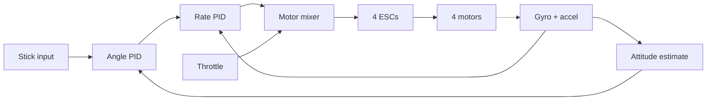

Writing the software that keeps a quadcopter in the air. The capstone — a balancing robot in three axes, at 500Hz, with spinning blades and no floor to fall onto.

Read this before buying anything

Two honest statements, and they're both true at once:

**Buying a flight controller is the sane path.** A Betaflight-capable board costs £15-25, has an F4 or F7 processor with a dedicated gyro on SPI, runs a codebase with a decade of edge cases baked in, and works today. If you want a drone that flies, buy one. Nobody in the hobby writes their own.

**Building one is the learning path.** You'll understand attitude estimation, cascaded control loops, mixing, and failsafes in a way that reading about them never gives you. That's the reason to do it. Your version will fly worse than a £15 board, and that's fine — flying well isn't the point.

Also honest: the ESP32 is a mediocre choice for this. It's a 240MHz dual-core with WiFi, but its FPU is weak, its I2C is slow, and FreeRTOS scheduling makes truly deterministic 500Hz loop timing harder than on a bare F4. People have done it. It's a fight.

Safety — non-negotiable

Props are not a metaphor. 5" carbon props at 20,000 RPM will take skin off, and they will take an eye. An untuned quad doesn't wobble gently, it flips to full throttle and launches sideways into whatever is nearby.

|Rule|Why|
|---|---|
|**Props off** for all bench work|100% of your development happens here|
|Eye protection whenever props are on|Non-negotiable, not once|
|Test outdoors, nothing valuable nearby|First hover will be ugly|
|Arm/disarm switch, always|Must be able to kill motors instantly|
|Failsafe that cuts throttle on signal loss|A flyaway is dangerous and you never get it back|
|Never hold it while armed|It will jump out of your hand|
|Motor direction verified props off|Wrong direction = instant flip on takeoff|
|LiPos: bag them, never leave charging unattended|They burn very enthusiastically|

Follow your country's drone rules. In the UK that's the CAA — registration, an operator ID, and no flying over people or near airports.

What you'll learn

- Brushless motors and ESCs — a completely different power system to DC motors
- Attitude estimation in 3D: roll, pitch and yaw from an IMU
- Cascaded PID: an angle loop feeding a rate loop
- Motor mixing — turning three axis commands plus throttle into four motor outputs
- Failsafes and arming logic as first-class design concerns

Parts

|Part|Qty|Rough price|Already own?|
|---|---|---|---|
|ESP32 dev board|1|£8|Yes|
|MPU6050 (or better, MPU9250 / ICM-20602)|1|£3-12|MPU6050 from the balancer|
|2205 brushless motors, ~2300KV|4|£40|No|
|20-30A BLHeli ESCs|4|£30|No|
|250mm quad frame|1|£20|No|
|5" props (buy 10, you'll break them)|10|£10|No|
|3S 1500mAh LiPo + charger|1|£45|No|
|LiPo safe bag|1|£8|No|
|RC transmitter + receiver (or use WiFi/BT)|1|£60|No|
|Power distribution board / 5V BEC|1|£8|No|

Realistically £220+. This is not a cheap project, and the LiPo charger and safe bag are not the places to economise.

Wiring

```
                      FRONT
        M1 (CW)                 M2 (CCW)
           \                     /
            \                   /
             ┌───────────────┐
             │   ESP32 +     │
             │   MPU6050     │
             └───────────────┘
            /                   \
           /                     \
        M3 (CCW)                M4 (CW)
                       REAR

  LiPo 3S ──── PDB ──┬── ESC1 ── M1
                     ├── ESC2 ── M2
                     ├── ESC3 ── M3
                     └── ESC4 ── M4
                     │
                     └── 5V BEC ── ESP32 VIN

        ESP32                        ESCs (signal wires only)
     ┌──────────┐
     │  GPIO12  ├──────────────────── ESC1 signal
     │  GPIO13  ├──────────────────── ESC2 signal
     │  GPIO14  ├──────────────────── ESC3 signal
     │  GPIO15  ├──────────────────── ESC4 signal
     │  GPIO21  ├──────────────────── MPU6050 SDA
     │  GPIO22  ├──────────────────── MPU6050 SCL
     │  3V3     ├──────────────────── MPU6050 VCC
     │  GPIO16  ├──────────────────── RX receiver signal
     │  GND     ├──────┬───────────── MPU6050 GND
     └──────────┘      └───────────── all four ESC grounds
```

|From|To|Note|
|---|---|---|
|LiPo|PDB main pads|solder, don't twist|
|PDB pads ×4|ESC power in (red/black)|each ESC gets full pack voltage|
|ESC 1-4 signal|ESP32 GPIO12/13/14/15|3.3V logic is fine for ESCs|
|ESC 1-4 ground|ESP32 GND|**mandatory** — signal reference|
|ESC red/5V wire|**cut or leave disconnected**|see below|
|5V BEC out|ESP32 VIN|one clean 5V source only|
|MPU6050 VCC / GND|ESP32 3V3 / GND|—|
|MPU6050 SDA / SCL|ESP32 GPIO21 / GPIO22|keep these wires short|
|Motor 3 wires|ESC 3 wires|any order; swap any two to reverse|
|Receiver signal|ESP32 GPIO16|via UART for SBUS/CRSF|

Things that will destroy hardware here:

- **Never connect more than one ESC's 5V BEC output to the same rail.** Two BECs fighting over a rail is a classic way to cook everything downstream. Use one, cut the red wire on the other three.
- **Never plug in the LiPo backwards.** There is no protection. It's instant, expensive and smoky.
- **Mount the IMU on foam or damping gel.** Prop vibration couples straight into the accelerometer and swamps the signal. This is the single most common reason a homebuilt quad won't fly, and no amount of PID tuning fixes it.
- **A 3S LiPo is 11.1V.** Nothing on that rail may touch the ESP32 directly.

How it works

**Brushless motors and ESCs.** These are not DC motors. There are no brushes; three phases must be energised in the right sequence at the right instant, and the ESC does that by sensing back-EMF to work out where the rotor is. You send the ESC a throttle command and it handles the rest. Modern protocols like DShot600 are digital, but PWM (1000-2000µs, exactly like a servo) works and is far easier to get right first. See [[Brushless Motors and ESCs]] and compare with [[DC Motors]].

**How a quad actually flies.** Four fixed-pitch props all pointing down. Total thrust versus weight controls altitude; differences between motors control attitude. Two spin CW and two CCW so their reaction torques cancel — that's why yaw works at all: speed up the CW pair and slow the CCW pair, net thrust unchanged, but the frame twists. See [[Thrust, Lift and how Drones fly]].

A quad is *unstable*. Left alone it tips over. The only thing keeping it level is a control loop running hundreds of times per second. It's [[Self balancing robot]] in three axes with no ground to catch it — which is exactly why you should build that one first.

**Motor mixing** — the whole geometry in four lines:

|Motor|Position|Rotation|Mix|
|---|---|---|---|
|M1|front-left|CW|`throttle - roll + pitch + yaw`|
|M2|front-right|CCW|`throttle + roll + pitch - yaw`|
|M3|rear-left|CCW|`throttle - roll - pitch - yaw`|
|M4|rear-right|CW|`throttle + roll - pitch + yaw`|

**Cascaded PID.** One loop isn't enough. The outer loop takes your stick angle and outputs a desired rotation *rate*; the inner loop drives the motors to hit that rate. Rate mode (acro) is the inner loop alone — harder to fly, what racers use. Angle mode (self-levelling) is both.



Loop rate matters enormously. 250Hz is a workable floor; 500Hz+ is what you want. The rate loop must run at a fixed interval or the D term differentiates timing jitter and you get noise-driven twitching. Filtering is critical — see [[Noise and Filtering]] and [[Feedback and PID control]].

**Power.** Four 2205 motors at full throttle pull 15-20A each. A 1500mAh 3S gives you 4-6 minutes of flight. Voltage sags hard under load, so a fresh 12.6V pack reads 10.5V at full throttle and your PID sees different authority at different battery levels. See [[Batteries and Power budgets]]. Weight distribution and [[Centre of mass and Stability]] matter too — a nose-heavy quad needs constant pitch correction just to hover.

Code

This is a skeleton, not a flight-ready controller. It has the loop structure, mixing and failsafe, but no proper attitude estimation on yaw, no gyro filtering worth the name, and no receiver parsing. Treat it as the frame to build in.

```cpp
/*
1. arm/disarm gate: motors are dead unless explicitly armed at zero throttle
2. fixed-rate loop at 500Hz, dt must be constant
3. angle PID (outer) produces a target rate, rate PID (inner) drives motors
4. mixer turns throttle + roll + pitch + yaw into four ESC values
5. failsafe cuts throttle if the receiver goes quiet
   PROPS OFF for every single test until every stage is verified.
*/

#include <Wire.h>
#include <ESP32Servo.h>

const int MPU = 0x68;
const int ESC_PINS[4] = {12, 13, 14, 15};   // M1 FL, M2 FR, M3 RL, M4 RR

Servo esc[4];

const int MIN_US  = 1000;    // ESC idle / disarmed
const int ARM_US   = 1050;   // just spinning
const int MAX_US  = 2000;    // full throttle

// ---- rate PID (inner loop), the one that actually matters ----
float rKp = 0.9, rKi = 0.02, rKd = 0.012;
// ---- angle PID (outer loop), self-levelling ----
float aKp = 4.0;

const float MAX_ANGLE = 25.0;     // degrees of stick authority
const float MAX_RATE  = 200.0;    // deg/s the rate loop will command

float rollAngle = 0, pitchAngle = 0;
float gyroBias[3] = {0, 0, 0};

float rateI[3]    = {0, 0, 0};
float lastRateErr[3] = {0, 0, 0};

bool  armed = false;
unsigned long lastRx = 0;
const unsigned long RX_TIMEOUT_MS = 500;

// stick inputs, normally from the receiver. -1..1 for axes, 0..1 for throttle
float inThrottle = 0, inRoll = 0, inPitch = 0, inYaw = 0;

unsigned long lastLoop = 0;
const unsigned long LOOP_US = 2000;   // 2ms -> 500Hz

void writeReg(uint8_t reg, uint8_t val) {
  Wire.beginTransmission(MPU);
  Wire.write(reg); Wire.write(val);
  Wire.endTransmission();
}

// gx, gy, gz in deg/s; ax, ay, az in g
void readIMU(float *g, float *a) {
  Wire.beginTransmission(MPU);
  Wire.write(0x3B);
  Wire.endTransmission(false);
  Wire.requestFrom(MPU, 14, true);

  int16_t rax = Wire.read() << 8 | Wire.read();
  int16_t ray = Wire.read() << 8 | Wire.read();
  int16_t raz = Wire.read() << 8 | Wire.read();
  Wire.read(); Wire.read();
  int16_t rgx = Wire.read() << 8 | Wire.read();
  int16_t rgy = Wire.read() << 8 | Wire.read();
  int16_t rgz = Wire.read() << 8 | Wire.read();

  a[0] = rax / 16384.0;  a[1] = ray / 16384.0;  a[2] = raz / 16384.0;

  // 65.5 LSB per deg/s at the +-500 deg/s range set below
  g[0] = rgx / 65.5 - gyroBias[0];
  g[1] = rgy / 65.5 - gyroBias[1];
  g[2] = rgz / 65.5 - gyroBias[2];
}

void calibrateGyro() {
  float sum[3] = {0, 0, 0};
  float g[3], a[3];

  for (int i = 0; i < 1000; i++) {
    readIMU(g, a);
    for (int k = 0; k < 3; k++) sum[k] += g[k] + gyroBias[k];
    delayMicroseconds(1500);
  }
  for (int k = 0; k < 3; k++) gyroBias[k] = sum[k] / 1000.0;
}

void writeMotors(int m1, int m2, int m3, int m4) {
  int v[4] = {m1, m2, m3, m4};
  for (int i = 0; i < 4; i++) {
    esc[i].writeMicroseconds(constrain(v[i], MIN_US, MAX_US));
  }
}

void disarm() {
  armed = false;
  for (int i = 0; i < 4; i++) rateI[i] = 0;   // never carry integral across
  writeMotors(MIN_US, MIN_US, MIN_US, MIN_US);
}

// one axis of the inner rate loop
float rateLoop(int axis, float targetRate, float actualRate, float dt) {
  float err = targetRate - actualRate;

  rateI[axis] += err * dt;
  rateI[axis] = constrain(rateI[axis], -50, 50);     // anti-windup

  float d = (err - lastRateErr[axis]) / dt;
  lastRateErr[axis] = err;

  return rKp * err + rKi * rateI[axis] + rKd * d;
}

void setup() {
  Serial.begin(115200);

  Wire.begin(21, 22);
  Wire.setClock(400000);

  writeReg(0x6B, 0x00);      // wake
  delay(100);
  writeReg(0x1A, 0x03);      // DLPF 44Hz
  writeReg(0x1B, 0x08);      // gyro +-500 deg/s
  writeReg(0x1C, 0x10);      // accel +-8g

  ESP32PWM::allocateTimer(0);
  ESP32PWM::allocateTimer(1);

  for (int i = 0; i < 4; i++) {
    esc[i].setPeriodHertz(250);              // 250Hz PWM, faster than servo rate
    esc[i].attach(ESC_PINS[i], MIN_US, MAX_US);
  }

  // ESCs must see minimum throttle at boot or they refuse to arm
  writeMotors(MIN_US, MIN_US, MIN_US, MIN_US);
  delay(3000);

  Serial.println("hold still, calibrating");
  calibrateGyro();

  float g[3], a[3];
  readIMU(g, a);
  rollAngle  = atan2(a[1], a[2]) * 180.0 / PI;
  pitchAngle = atan2(-a[0], sqrt(a[1]*a[1] + a[2]*a[2])) * 180.0 / PI;

  disarm();
  lastLoop = micros();
  Serial.println("ready. PROPS OFF.");
}

void loop() {
  // TODO: parse your receiver here and set inThrottle/inRoll/inPitch/inYaw
  //       every valid frame must do: lastRx = millis();

  if (micros() - lastLoop < LOOP_US) return;
  float dt = (micros() - lastLoop) / 1000000.0;
  lastLoop = micros();

  float g[3], a[3];
  readIMU(g, a);

  // attitude: complementary filter, same idea as the balancing robot
  float accRoll  = atan2(a[1], a[2]) * 180.0 / PI;
  float accPitch = atan2(-a[0], sqrt(a[1]*a[1] + a[2]*a[2])) * 180.0 / PI;

  rollAngle  = 0.995 * (rollAngle  + g[0] * dt) + 0.005 * accRoll;
  pitchAngle = 0.995 * (pitchAngle + g[1] * dt) + 0.005 * accPitch;

  // FAILSAFE: no receiver frames recently, drop out of the sky under control
  if (millis() - lastRx > RX_TIMEOUT_MS) {
    if (armed) Serial.println("FAILSAFE: rx lost");
    disarm();
    return;
  }

  // arming gate: only ever arm at zero throttle
  if (!armed) {
    if (inThrottle < 0.05) {
      // set armed = true from an explicit switch on your transmitter
    }
    writeMotors(MIN_US, MIN_US, MIN_US, MIN_US);
    return;
  }

  // --- outer loop: stick angle -> desired rotation rate ---
  float targetRoll  = inRoll  * MAX_ANGLE;
  float targetPitch = inPitch * MAX_ANGLE;

  float rateTargetRoll  = constrain(aKp * (targetRoll  - rollAngle),
                                    -MAX_RATE, MAX_RATE);
  float rateTargetPitch = constrain(aKp * (targetPitch - pitchAngle),
                                    -MAX_RATE, MAX_RATE);
  float rateTargetYaw   = inYaw * MAX_RATE;   // yaw is rate-only, always

  // --- inner loop: hit those rates ---
  float roll  = rateLoop(0, rateTargetRoll,  g[0], dt);
  float pitch = rateLoop(1, rateTargetPitch, g[1], dt);
  float yaw   = rateLoop(2, rateTargetYaw,   g[2], dt);

  // leave headroom at the top so corrections still work near full throttle
  int base = ARM_US + (int)(inThrottle * (MAX_US - 200 - ARM_US));

  // --- the mixer ---
  writeMotors(
    base - roll + pitch + yaw,    // M1 front-left  CW
    base + roll + pitch - yaw,    // M2 front-right CCW
    base - roll - pitch - yaw,    // M3 rear-left   CCW
    base + roll - pitch + yaw     // M4 rear-right  CW
  );
}
```

Bring-up order, props off for every step:

|Step|Check|
|---|---|
|1|Print the attitude. Tilt by hand — roll and pitch must read correct sign and settle back to ~0|
|2|Verify each ESC individually. Motor 1 command spins motor 1, and in the right direction|
|3|Arm at low throttle. Tilt the frame by hand and confirm the *correct* motors speed up to resist you|
|4|Confirm failsafe: unplug the receiver and watch motors stop|
|5|Props on, outdoors, eye protection. Hover 30cm up for 5 seconds. Land. Adjust. Repeat|

Step 3 is where sign errors show up, and a sign error with props on flips the quad instantly. Do not skip it.

Make it better

- Switch from PWM to DShot600 for the ESCs — digital, faster, no calibration
- Add a proper gyro low-pass and notch filter to reject prop-frequency vibration
- Add a barometer (BMP280) for altitude hold, and GPS for position hold
- Blackbox-log every loop to SPIFFS and tune from data rather than from vibes
- Upgrade to a 32-bit gyro on SPI, or move the whole thing to an F4 — and then go read the Betaflight source, which will make far more sense now
