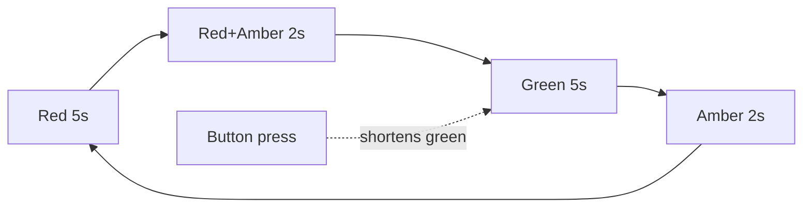

Three LEDs running a real UK traffic light sequence, with a pedestrian request button.

What you'll learn

- Driving several outputs from one loop
- State machines — the pattern behind almost every embedded program
- Getting rid of `delay()` for good
- Handling an input that arrives mid-sequence

Parts

|Part|Qty|Rough price|Already own?|
|---|---|---|---|
|ESP32 dev board|1|£8|Yes|
|Breadboard + wires|1|£7|Yes|
|Red / yellow / green LEDs|3|£0.30|Yes|
|220Ω resistor|3|£0.15|Yes|
|Tactile push button|1|£0.15|From the last project|

Wiring

```
        ESP32
     ┌─────────┐
     │  GPIO2  ├───[220Ω]───▶|─── GND      RED
     │         │
     │  GPIO4  ├───[220Ω]───▶|─── GND      YELLOW
     │         │
     │  GPIO5  ├───[220Ω]───▶|─── GND      GREEN
     │         │
     │  GPIO18 ├───[BTN]───────── GND      pedestrian request
     │         │
     │  GND    ├─────────────────────── breadboard GND rail
     └─────────┘
```

|From|To|Note|
|---|---|---|
|ESP32 GPIO2|220Ω → red LED anode|red LED|
|ESP32 GPIO4|220Ω → yellow LED anode|yellow LED|
|ESP32 GPIO5|220Ω → green LED anode|green LED|
|All three LED cathodes|GND rail|short legs together|
|ESP32 GPIO18|Button pin 1|INPUT_PULLUP|
|Button pin 2|GND rail|pressed = LOW|
|ESP32 GND|GND rail|one wire feeds the whole rail|

Each LED gets its own resistor. Sharing one resistor across three LEDs means the brightness changes depending on how many are lit — and if you ever light two at once they fight over the current.

How it works

Nothing new electrically — it's three copies of [[Blink an LED]] plus one copy of the button from [[Button controlled LED]]. What's new is the *structure*.

The naive version is a chain of `delay()` calls. It works until you add the button: during a 5-second `delay()` the CPU is asleep and a press is simply lost. You can't fix that by adding more delays.

The fix is a state machine. You store which phase you're in and when it started, and every time round the loop you ask "has this phase been running long enough?" The CPU is never blocked, so it can watch the button thousands of times per second. This is the single most useful pattern in embedded work — see [[Non-blocking timing]].

Three LEDs at ~6mA each is ~18mA total, which is fine. But be aware the ESP32 has a limit on total current across all pins, not just per pin. Twenty LEDs straight off GPIOs is asking for trouble; use [[Transistors and MOSFETs]] when you get there.

State diagram:



Code

```cpp
/*
1. an enum names the phases so the code reads like the real thing
2. phaseStart records when the current phase began
3. each loop we compare millis() against the phase's duration
4. nothing blocks, so the button is polled constantly
5. a pending request just cuts the green phase short
*/

const int RED    = 2;
const int YELLOW = 4;
const int GREEN  = 5;
const int BUTTON = 18;

enum Phase { P_RED, P_RED_AMBER, P_GREEN, P_AMBER };

Phase phase = P_RED;
unsigned long phaseStart = 0;
bool requestPending = false;

int lastButton = HIGH;
unsigned long lastBounce = 0;

// how long each phase lasts, in ms
unsigned long phaseLength(Phase p) {
  switch (p) {
    case P_RED:       return 5000;
    case P_RED_AMBER: return 2000;
    case P_GREEN:     return 5000;
    case P_AMBER:     return 2000;
  }
  return 1000;
}

void applyLights() {
  // drive all three every time, so no stale LED can be left on
  digitalWrite(RED,    phase == P_RED || phase == P_RED_AMBER);
  digitalWrite(YELLOW, phase == P_RED_AMBER || phase == P_AMBER);
  digitalWrite(GREEN,  phase == P_GREEN);
}

void nextPhase() {
  switch (phase) {
    case P_RED:       phase = P_RED_AMBER; break;
    case P_RED_AMBER: phase = P_GREEN;     break;
    case P_GREEN:     phase = P_AMBER;     break;
    case P_AMBER:     phase = P_RED;
                      requestPending = false;   // pedestrian has had their turn
                      break;
  }
  phaseStart = millis();
  applyLights();
}

void setup() {
  pinMode(RED, OUTPUT);
  pinMode(YELLOW, OUTPUT);
  pinMode(GREEN, OUTPUT);
  pinMode(BUTTON, INPUT_PULLUP);
  Serial.begin(115200);

  phaseStart = millis();
  applyLights();
}

void loop() {
  // --- button, debounced, non-blocking ---
  int reading = digitalRead(BUTTON);
  if (reading != lastButton && millis() - lastBounce > 50) {
    lastBounce = millis();
    if (reading == LOW && !requestPending) {
      requestPending = true;
      Serial.println("pedestrian waiting");
    }
    lastButton = reading;
  }

  // --- timing ---
  unsigned long elapsed = millis() - phaseStart;
  unsigned long limit   = phaseLength(phase);

  // a waiting pedestrian cuts green short after 1.5s minimum
  if (phase == P_GREEN && requestPending && elapsed > 1500) {
    nextPhase();
    return;
  }

  if (elapsed >= limit) {
    nextPhase();
  }
}
```

Make it better

- Add a second set of lights for the crossing itself (red man / green man)
- Flash the green man for 3 seconds before it goes back to red
- Add a night mode where everything just blinks amber
- Drive the whole thing from a lookup table of `{phase, duration, redOn, amberOn, greenOn}` instead of switches
