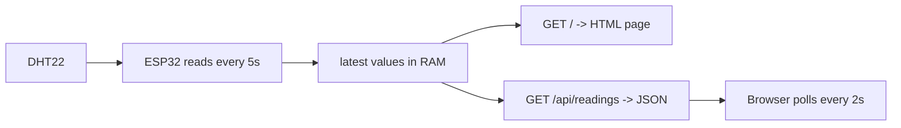

The ESP32 joins your WiFi, runs a tiny HTTP server, and serves a live page showing the sensor readings. Your first web backend that is also a physical object.

What you'll learn

- The ESP32 as a network device, not just a blinker
- Serving HTML and a JSON API from 320KB of RAM
- Why you serve JSON and poll, instead of re-rendering the page
- mDNS so you don't have to memorise an IP

Parts

|Part|Qty|Rough price|Already own?|
|---|---|---|---|
|ESP32 dev board|1|£8|Yes|
|Breadboard + wires|1|£7|Yes|
|DHT22 sensor|1|£4|From the last project|
|10kΩ resistor|1|£0.05|Yes|

Wiring

Identical to [[Temperature and humidity logger]] — nothing changes physically, all the new work is in software.

```
  3V3 ──────────┬─────────────────┐
                │                 │
              [10kΩ]              │
                │                 │
     ┌──────────┴─── ESP32 GPIO4  │  DATA
     │                            │
  ┌──┴──────────────┐             │
  │     DHT22       │             │
  │ VCC  DATA  NC  GND            │
  └──┬────────────┬──┘            │
     │            │               │
     └────────────┼───────────────┘
                  │
                 GND ───────────── ESP32 GND
```

|From|To|Note|
|---|---|---|
|DHT22 VCC|ESP32 3V3|3.3V only|
|DHT22 DATA|ESP32 GPIO4|data line|
|DHT22 DATA|10kΩ → 3V3|pull-up holds the idle line high|
|DHT22 GND|ESP32 GND|common ground|

One thing that bites people here: if you're also reading an analog sensor, it **must** be on an ADC1 pin (GPIO32-39). ADC2 shares hardware with the WiFi radio and `analogRead` on those pins silently returns rubbish the moment WiFi is up. See [[Analog input and ADC (ESP32)]].

How it works

The ESP32 has a full 2.4GHz WiFi radio and a TCP/IP stack on the chip. In station mode it joins your router like a phone would and gets an IP over DHCP. From there `WebServer` gives you an API that will feel very familiar — you register handlers on routes and return a body with a content type. It's Express with 320KB of RAM. Background in [[WiFi (ESP32)]].

Architecture:



The important design decision: the HTML page is served **once**, and after that the browser polls `/api/readings` for JSON. You don't regenerate the page on the server. Two reasons — string-building HTML on a microcontroller eats RAM and fragments the heap, and a full page reload every 2 seconds is horrible to look at.

Note `PROGMEM` on the HTML. That keeps the string in flash instead of copying it into RAM at boot. On a machine with 320KB total, a 2KB page you never modify has no business living in RAM.

2.4GHz only. The ESP32 cannot see a 5GHz network. If your router broadcasts one SSID for both bands and it won't connect, that's usually why.

Code

```cpp
/*
1. connect to WiFi in station mode and wait for an IP
2. mDNS makes the board reachable at http://esp-sensor.local
3. the HTML page lives in flash (PROGMEM) and is served once
4. /api/readings returns JSON, the browser polls it
5. the sensor is read on a timer, never inside a request handler
*/

#include <WiFi.h>
#include <WebServer.h>
#include <ESPmDNS.h>
#include <DHT.h>

const char* SSID     = "your-network";
const char* PASSWORD = "your-password";

#define DHT_PIN  4
#define DHT_TYPE DHT22

DHT dht(DHT_PIN, DHT_TYPE);
WebServer server(80);

float lastTemp = NAN;
float lastHum  = NAN;
unsigned long lastRead = 0;
unsigned long readCount = 0;

// kept in flash, not RAM. R"( ... )" is a raw string so quotes need no escaping
const char PAGE_HTML[] PROGMEM = R"rawliteral(
<!DOCTYPE html>
<html>
<head>
  <meta charset="utf-8">
  <meta name="viewport" content="width=device-width, initial-scale=1">
  <title>ESP32 sensor</title>
  <style>
    body { font-family: system-ui, sans-serif; background:#111; color:#eee;
           display:flex; flex-direction:column; align-items:center;
           justify-content:center; height:100vh; margin:0; }
    .card { background:#1c1c1c; border-radius:12px; padding:24px 40px;
            margin:8px; text-align:center; min-width:180px; }
    .value { font-size:3rem; font-weight:600; }
    .label { color:#888; text-transform:uppercase; font-size:0.75rem;
             letter-spacing:0.1em; }
    .stale { opacity:0.4; }
  </style>
</head>
<body>
  <div class="card"><div class="label">Temperature</div>
    <div class="value" id="t">--</div></div>
  <div class="card"><div class="label">Humidity</div>
    <div class="value" id="h">--</div></div>
  <div class="label" id="status">connecting</div>

<script>
async function tick() {
  try {
    const r = await fetch('/api/readings');
    const d = await r.json();
    document.getElementById('t').textContent = d.temperature.toFixed(1) + ' C';
    document.getElementById('h').textContent = d.humidity.toFixed(0) + ' %';
    document.getElementById('status').textContent =
      'uptime ' + Math.floor(d.uptime / 1000) + 's, ' + d.reads + ' reads';
    document.body.classList.remove('stale');
  } catch (e) {
    document.body.classList.add('stale');   // board went away, grey it out
  }
}
tick();
setInterval(tick, 2000);
</script>
</body>
</html>
)rawliteral";

void handleRoot() {
  server.send_P(200, "text/html", PAGE_HTML);   // _P = read from flash
}

void handleReadings() {
  // small enough to build by hand, no JSON library needed
  char body[160];
  snprintf(body, sizeof(body),
    "{\"temperature\":%.1f,\"humidity\":%.1f,\"uptime\":%lu,\"reads\":%lu}",
    isnan(lastTemp) ? 0.0 : lastTemp,
    isnan(lastHum)  ? 0.0 : lastHum,
    millis(), readCount);

  server.sendHeader("Access-Control-Allow-Origin", "*");
  server.send(200, "application/json", body);
}

void setup() {
  Serial.begin(115200);
  dht.begin();

  WiFi.mode(WIFI_STA);                 // station: join a network, don't create one
  WiFi.begin(SSID, PASSWORD);
  Serial.print("connecting");

  while (WiFi.status() != WL_CONNECTED) {
    delay(400);
    Serial.print(".");
  }

  Serial.println();
  Serial.print("http://");
  Serial.println(WiFi.localIP());      // the IP your router handed out

  // now also reachable at http://esp-sensor.local
  if (MDNS.begin("esp-sensor")) {
    Serial.println("http://esp-sensor.local");
  }

  server.on("/", handleRoot);
  server.on("/api/readings", handleReadings);
  server.onNotFound([]() { server.send(404, "text/plain", "not found"); });
  server.begin();
}

void loop() {
  server.handleClient();               // must be called constantly, never block

  if (millis() - lastRead > 5000) {
    lastRead = millis();

    float t = dht.readTemperature();
    float h = dht.readHumidity();

    // only overwrite on a good read, so a glitch doesn't blank the dashboard
    if (!isnan(t) && !isnan(h)) {
      lastTemp = t;
      lastHum  = h;
      readCount++;
    }
  }
}
```

Never do slow work inside a request handler. `server.handleClient()` is cooperative — if a handler takes 2 seconds reading a sensor, every other request queues behind it and the watchdog may reset the board. Read on a timer, serve from memory.

Make it better

- Add a `/api/history` endpoint returning the last 60 samples, and draw a sparkline in the page
- Swap polling for a WebSocket so the board pushes updates (the `WebSocketsServer` library)
- Add a POST route with an LED toggle so the page can control hardware, not just watch it
- Move credentials out of the sketch: use `WiFiManager` to serve a setup page on first boot
- Push readings to a real backend — an Actix Web service would fit nicely alongside [[Actix Web]]
