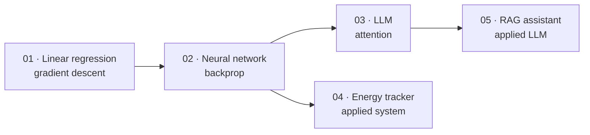

# Machine Learning Research Engineer

A **from-scratch** track. Every algorithm implemented by hand before touching a framework.

Index: [[App projects]] · Knowledge base: [[ULTIMATE ENGINEER]]

---

## Why this track exists

[[28 — PROJECTS]] (Projects 001-010) teaches you to **build systems** — pipelines, APIs, deployment.

This track teaches you to **understand algorithms**. You implement linear regression, then a neural network, then an LLM, with no `sklearn` and no `torch.nn`. When you later call `loss.backward()`, you know exactly what it does because you wrote it.

> **Research engineers need both.** Systems knowledge gets the experiment running; from-scratch knowledge lets you debug a model that trains but doesn't learn.

## The projects

| # | Project | Implements | Language |
|---|---|---|---|
| 01 | [[Project 01 - Linear Regression from Scratch]] | Gradient descent, MSE | Python → Rust/C/C++ |
| 02 | [[Project 02 - Neural Network from Scratch]] | Backprop, autograd | Python → C++ |
| 03 | [[Project 03 - LLM from Scratch]] | Attention, transformer, tokeniser | Python |
| 04 | [[Project 04 - Smart Home Energy and Water Tracker]] | An end-to-end applied system | Full stack |
| 05 | [[Project 05 - Notes Intelligence Assistant]] | RAG over your own vault | Python |

## Maths you need

All of it is in [[Mathematics reference]]:

| Project | Maths |
|---|---|
| 01 | Derivatives, gradients, MSE, gradient descent |
| 02 | **Chain rule**, matrix multiplication, activation derivatives |
| 03 | Softmax, dot products, attention |
| 04 | Statistics, time series |
| 05 | Cosine similarity, embeddings |

## Related

[[28 — PROJECTS]] — the systems track · [[27 — ML RESEARCH]] · [[09 — DEEP LEARNING]] · [[App projects]]
