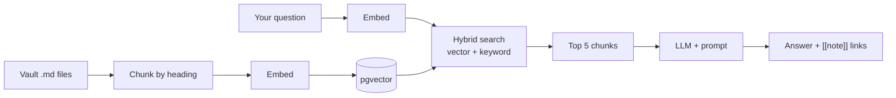

# Project 05 - Notes Intelligence Assistant

Track: [[Machine Learning Research Engineer]] · Previous: [[Project 03 - LLM from Scratch]]

---

## What you're building

A RAG system over **this Obsidian vault**. Ask a question in plain English, get an answer grounded in your own notes, with links back to the exact notes it used.

The vault answers questions about itself.

## Why

It's the most directly useful thing in the track — and it's [[LLM and GenAI track]] applied to data you know intimately, so you can immediately tell when the answer is wrong.

## Concepts used

| Concept | Note |
|---|---|
| Embeddings, cosine similarity | [[Mathematics reference]] |
| Chunking, retrieval, generation | [[LLM and GenAI track]] |
| Vector storage (pgvector) | [[PostgreSQL reference]] |
| Prompting, structured output | [[LLM and GenAI track]] |
| Serving | [[FastAPI fundamentals]] |
| Evals | [[LLM and GenAI track]] |

## Architecture

## Build steps

- [ ] **1 — Chunk by heading, not by character count.**
  Markdown gives you natural boundaries. Keep the heading trail as context:
  `"33 — SYSTEMS PERFORMANCE > When to leave Python > Rung 3 — Vectorise"`

  > **Chunking is where RAG quality is won or lost** ([[LLM and GenAI track]]). A chunk cut through the middle of a table retrieves badly forever.

- [ ] **2 — Embed and store** in Postgres with `pgvector`. No separate vector database needed at this scale.
- [ ] **3 — Retrieve.** Cosine similarity, top-k.
- [ ] **4 — Add keyword search and merge rankings (hybrid).** Vector search is bad at exact terms like `path.style.access`; keyword search is bad at meaning. **Together they're much better than either.**
- [ ] **5 — Generate**, with the three rules: *only use the context, cite the source note, say "I don't know" if it isn't there.*
- [ ] **6 — Return `[[wikilinks]]`** so answers are clickable inside Obsidian.
- [ ] **7 — Build an eval set.** 30 questions you know the answers to. Score before and after every change.
- [ ] **8 — Serve it** — FastAPI + a small UI, or an Obsidian plugin.

## Checkpoints

- [ ] Retrieval returns the note *you* would have opened
- [ ] Answers cite notes, and the citations are correct
- [ ] It says "I don't know" for something genuinely absent
- [ ] Hybrid search beats pure vector on your eval set — **measured, not assumed**
- [ ] Asking *"why is my Docker container failing?"* returns [[Docker deep dive]]

## What will go wrong

| Symptom | Cause | Fix |
|---|---|---|
| Irrelevant chunks | Chunking, or pure vector search | Chunk on headings; add keyword search |
| Right chunk retrieved, wrong answer | Generation problem | Fix the prompt; less irrelevant context |
| Confidently invents things | No grounding instruction | "Only use the context" + citations |
| Can't find exact terms | Vector search weakness | Hybrid |
| Cost creeping up | No caching | Prompt caching ([[LLM and GenAI track]]) |

> **Log the retrieved chunks for every query.** Most "the LLM is hallucinating" complaints are retrieval failures — the model answered faithfully from the wrong chunks.

## Related

[[LLM and GenAI track]] · [[Large language models]] · [[PostgreSQL reference]] · [[FastAPI fundamentals]] · [[Project 03 - LLM from Scratch]]
