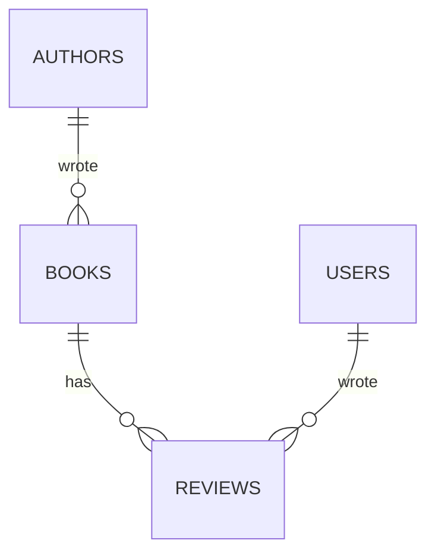

# Flask SQLite - book tracker

**A site where people rate books, built the way a real Flask app is laid out.** Four tables joined together, averages and counts, pages of results, and the routes split across files instead of piled into one.

Stack: [[Flask SQLite stack]] · Do this one first: [[Flask SQLite - notes app]] · Hub: [[Flask]]

> ✅ **Built and tested on Flask 3.1.3, Python 3.14, SQLite 3.50.4.** 48 checks, output pasted in at the bottom.

---

## What's new compared with project 1

Project 1 was one file and two tables. This is the same ideas, grown up:

| New thing | Why you'd want it |
|---|---|
| **App factory** | a function that builds the app, so tests can build a second one on a throwaway database |
| **Blueprints** | routes split into `auth.py` and `books.py` instead of one 600-line file |
| **JOINs** | the book list shows the author's *name*, which lives in another table |
| **Aggregates** | average rating and review counts, worked out by SQLite, not Python |
| **Pagination** | 5 books a page instead of all 500 at once |
| **Insert-or-update** | one query that leaves a review *or* changes your existing one |
| **A JSON endpoint** | the same data for JavaScript or another program |

---

## What you're building

| Page | URL | What's interesting about it |
|---|---|---|
| Book list | `/` | search, 5 sort orders, pagination, author name and average rating per row |
| One book | `/books/<id>` | its reviews with names, and your own review form |
| Stats | `/books/stats` | counts and averages per author, plus the best-rated books |
| JSON | `/books/api` | the list as JSON |
| Accounts | `/register`, `/login`, `/logout` | the same as project 1 |

---

## The four tables



| Table | Columns |
|---|---|
| `authors` | `id`, `name` |
| `books` | `id`, **`author_id`**, `title`, `year`, `pages` |
| `users` | `id`, `username`, `password_hash` |
| `reviews` | `id`, **`user_id`**, **`book_id`**, `rating`, `comment`, `updated_at` |

The **bold** columns are the foreign keys — the ones holding another table's `id`. They are what every `JOIN` later is built on.

Read the crow's feet as "many": one author has **many** books, one book has **many** reviews, one user writes **many** reviews. `reviews` sits between books and users, which is what lets the same book be rated by lots of people.

### `schema.sql`

```sql
-- Four tables. The interesting part is how they are JOINED back together in books.py.
--
--   authors 1 ---- many books 1 ---- many reviews many ---- 1 users
--
-- "1 ---- many" means: one author has many books, and each book names ONE author.
-- That is what a foreign key gives you.

DROP TABLE IF EXISTS reviews;
DROP TABLE IF EXISTS books;
DROP TABLE IF EXISTS authors;
DROP TABLE IF EXISTS users;

CREATE TABLE users (
    id            INTEGER PRIMARY KEY AUTOINCREMENT,
    username      TEXT    NOT NULL UNIQUE,
    password_hash TEXT    NOT NULL,
    created_at    TEXT    NOT NULL DEFAULT (datetime('now'))
);

CREATE TABLE authors (
    id   INTEGER PRIMARY KEY AUTOINCREMENT,
    name TEXT    NOT NULL UNIQUE
);

CREATE TABLE books (
    id        INTEGER PRIMARY KEY AUTOINCREMENT,
    author_id INTEGER NOT NULL,
    title     TEXT    NOT NULL,
    year      INTEGER,            -- nullable: some books have no agreed year
    pages     INTEGER,
    FOREIGN KEY (author_id) REFERENCES authors (id) ON DELETE CASCADE
);

CREATE TABLE reviews (
    id         INTEGER PRIMARY KEY AUTOINCREMENT,
    user_id    INTEGER NOT NULL,
    book_id    INTEGER NOT NULL,
    rating     INTEGER NOT NULL CHECK (rating BETWEEN 1 AND 5),  -- the DB refuses 0 or 6
    comment    TEXT    NOT NULL DEFAULT '',
    updated_at TEXT    NOT NULL DEFAULT (datetime('now')),

    FOREIGN KEY (user_id) REFERENCES users (id) ON DELETE CASCADE,
    FOREIGN KEY (book_id) REFERENCES books (id) ON DELETE CASCADE,

    -- One review per person per book. This UNIQUE pair is also what makes the
    -- "insert or update" query in books.py possible - see ON CONFLICT there.
    UNIQUE (user_id, book_id)
);

-- Indexes on the columns we filter and join by.
CREATE INDEX idx_books_author ON books (author_id);
CREATE INDEX idx_reviews_book ON reviews (book_id);
CREATE INDEX idx_reviews_user ON reviews (user_id);
```

**The two lines that earn their keep:**

- `CHECK (rating BETWEEN 1 AND 5)` — the database itself refuses a rating of 0 or 99, whatever the code does
- `UNIQUE (user_id, book_id)` — one review per person per book, and it's what makes the insert-or-update query possible later

### `seed.sql` — something to look at

```sql
-- Sample data, so the pages have something to show the first time you open them.
-- "flask --app booktracker seed-db" runs this.

INSERT INTO authors (name) VALUES
    ('Ursula K. Le Guin'),
    ('Terry Pratchett'),
    ('Octavia E. Butler');

-- A SELECT inside the VALUES list looks up the author's id by name, so you do not
-- have to know that Le Guin happened to get id 1.
INSERT INTO books (author_id, title, year, pages) VALUES
    ((SELECT id FROM authors WHERE name = 'Ursula K. Le Guin'), 'A Wizard of Earthsea', 1968, 183),
    ((SELECT id FROM authors WHERE name = 'Ursula K. Le Guin'), 'The Dispossessed',     1974, 341),
    ((SELECT id FROM authors WHERE name = 'Ursula K. Le Guin'), 'The Left Hand of Darkness', 1969, 304),
    ((SELECT id FROM authors WHERE name = 'Terry Pratchett'),   'Mort',                 1987, 272),
    ((SELECT id FROM authors WHERE name = 'Terry Pratchett'),   'Guards! Guards!',      1989, 416),
    ((SELECT id FROM authors WHERE name = 'Octavia E. Butler'), 'Kindred',              1979, 264),
    ((SELECT id FROM authors WHERE name = 'Octavia E. Butler'), 'Parable of the Sower', 1993, 299);
```

---

## The files

```
booktracker/
├── booktracker/
│   ├── __init__.py          create_app() - builds the app, registers everything
│   ├── db.py                connect, query, execute, init-db, seed-db
│   ├── security.py          login state + CSRF, shared by both blueprints
│   ├── auth.py              blueprint: register / login / logout
│   ├── books.py             blueprint: list, detail, review, stats, api
│   ├── schema.sql
│   ├── seed.sql
│   ├── templates/
│   │   ├── layout.html
│   │   ├── auth/            login.html, register.html
│   │   └── books/           index.html, detail.html, stats.html
│   └── static/style.css
├── instance/                NOT in git - the database and real secrets
│   └── booktracker.db
└── test_booktracker.py
```

## Running it

```bash
pip install flask
flask --app booktracker init-db     # create the tables
flask --app booktracker seed-db     # add the sample authors and books
flask --app booktracker run --debug
```

`--app booktracker` points at the **folder** this time, not a file. Flask looks inside for `create_app()` and calls it.

---

## 1. `db.py` — all the database plumbing, in one place

```python
"""Everything to do with the database file lives here, and nowhere else.

In the one-file app these functions sat at the top of app.py. Pulled into their
own module they can be imported by every blueprint without importing the app,
which is what stops the circular-import headache.
"""

import sqlite3

import click  # Flask uses click for CLI commands; it comes with Flask
from flask import current_app, g


def get_db():
    """This request's connection, opened on first use.

    `current_app` is "whichever app is handling this request". Modules below the
    app cannot import the app object itself (that would be a circular import),
    so Flask hands it over through current_app instead.
    """
    if "db" not in g:
        g.db = sqlite3.connect(current_app.config["DATABASE"])
        g.db.row_factory = sqlite3.Row  # rows you can index by column name
        g.db.execute("PRAGMA foreign_keys = ON")  # SQLite needs this per connection
    return g.db


def close_db(exception=None):
    db = g.pop("db", None)
    if db is not None:
        db.close()


def query(sql, params=(), one=False):
    """Run a SELECT. Returns a list of rows, or a single row when one=True.

    A three-line helper that removes .execute(...).fetchall() from every view.
    """
    rows = get_db().execute(sql, params).fetchall()
    if one:
        return rows[0] if rows else None
    return rows


def execute(sql, params=()):
    """Run an INSERT / UPDATE / DELETE and save it. Returns the cursor.

    The cursor is worth having back: cursor.lastrowid is the id of a row you just
    inserted, and cursor.rowcount is how many rows an UPDATE or DELETE touched.
    """
    db = get_db()
    cursor = db.execute(sql, params)
    db.commit()  # without this, the change is thrown away when the request ends
    return cursor


def run_sql_file(name):
    """Feed a .sql file in this folder to the database."""
    db = get_db()
    # open_resource opens a file next to the package, whatever folder you ran
    # the app from - so this works the same from the project root or anywhere else.
    with current_app.open_resource(name) as f:
        db.executescript(f.read().decode("utf-8"))
    db.commit()


@click.command("init-db")
def init_db_command():
    """Create the tables: flask --app booktracker init-db"""
    run_sql_file("schema.sql")
    click.echo("Tables created.")


@click.command("seed-db")
def seed_db_command():
    """Add the sample authors and books: flask --app booktracker seed-db"""
    run_sql_file("seed.sql")
    click.echo("Sample data added.")


def init_app(app):
    """Wire this module into an app. Called by create_app().

    teardown_appcontext = "run this after every request, even a failed one".
    """
    app.teardown_appcontext(close_db)
    app.cli.add_command(init_db_command)
    app.cli.add_command(seed_db_command)
```

**Why `current_app` instead of importing the app.** `db.py` is imported *by* the app, so it cannot import the app back — Python would go round in a circle and fail. `current_app` means "whichever app is handling this request", which Flask fills in for you.

**`query()` and `execute()` are three lines each and worth it:** every view would otherwise repeat `get_db().execute(...).fetchall()` and remember to `commit()`.

| Helper | Use it for | Gives you |
|---|---|---|
| `query(sql, params)` | SELECT, many rows | a list of rows |
| `query(sql, params, one=True)` | SELECT, one row | the row, or `None` |
| `execute(sql, params)` | INSERT / UPDATE / DELETE | the cursor (`.lastrowid`, `.rowcount`) |

---

## 2. `security.py` — login state and CSRF, shared

Same logic as project 1, moved into its own module so both blueprints can import it.

```python
"""Login state and CSRF protection, shared by every blueprint.

Identical in behaviour to the one-file app - just in its own module now, so both
blueprints can import login_required instead of each having a copy.
"""

import hmac
import secrets
from functools import wraps

from flask import abort, flash, g, redirect, request, session, url_for

from .db import query  # the . means "from this same package"


def load_logged_in_user():
    """Before every request: turn the user id in the cookie into g.user."""
    user_id = session.get("user_id")
    g.user = None if user_id is None else query("SELECT * FROM users WHERE id = ?", (user_id,), one=True)


def login_required(view):
    @wraps(view)
    def wrapped_view(**kwargs):
        if g.user is None:
            flash("Please log in first.")
            # next= remembers where they were going, so login can send them back.
            return redirect(url_for("auth.login", next=request.path))
        return view(**kwargs)

    return wrapped_view


def csrf_token():
    if "csrf_token" not in session:
        session["csrf_token"] = secrets.token_urlsafe(32)
    return session["csrf_token"]


def check_csrf():
    """Reject every POST that does not carry this session's token."""
    if request.method == "POST":
        sent = request.form.get("csrf_token", "")
        expected = session.get("csrf_token", "")
        if not expected or not hmac.compare_digest(sent, expected):
            abort(400, "Missing or invalid CSRF token.")


def init_app(app):
    """Attach all of it to the app, in order: CSRF first, then load the user."""
    app.before_request(check_csrf)
    app.before_request(load_logged_in_user)
    # Templates can call csrf_token() and read `user` on any page.
    app.jinja_env.globals["csrf_token"] = csrf_token
    app.context_processor(lambda: {"user": g.get("user")})
```

> **`init_app(app)` is the pattern worth copying.** Each module gets a function that attaches its own bits to the app. Adding a feature later is one line in the factory, not a scavenger hunt.

---

## 3. `__init__.py` — the app factory

```python
"""The app factory.

A factory is just a function that builds and returns the app. Why bother?

  * Tests can build a second app pointed at a throwaway database.
  * Nothing runs at import time, so `from booktracker import db` is safe anywhere.
  * Settings (like which database) are arguments, not hard-coded globals.

"flask --app booktracker run" finds create_app() by name and calls it for you.
"""

import os

from flask import Flask

from . import auth, books, db, security


def create_app(test_config=None):
    # instance_relative_config points the "instance folder" at instance/ next to
    # the package. It is where the database and real secrets go, and it is the
    # one folder you add to .gitignore.
    app = Flask(__name__, instance_relative_config=True)

    app.config.from_mapping(
        SECRET_KEY=os.environ.get("SECRET_KEY", "dev-only-not-for-a-real-server"),
        DATABASE=os.path.join(app.instance_path, "booktracker.db"),
        PER_PAGE=5,  # rows per page in the books table
    )

    if test_config is None:
        # Real runs: load instance/config.py if it exists. silent=True means
        # "carry on if there isn't one", which is normal in development.
        app.config.from_pyfile("config.py", silent=True)
    else:
        app.config.update(test_config)

    # Flask does not create the instance folder itself.
    os.makedirs(app.instance_path, exist_ok=True)

    # Each module attaches its own pieces. Adding a feature later is one more line.
    db.init_app(app)
    security.init_app(app)

    # A blueprint is a bundle of routes living in its own file. Registering it
    # adds all of them at once. url_prefix means every route inside books.py
    # starts with /books, without repeating it on each @bp.route.
    app.register_blueprint(auth.bp)
    app.register_blueprint(books.bp, url_prefix="/books")

    # The home page is the book list. add_url_rule points "/" at an endpoint that
    # already exists, instead of writing a second view that does the same thing.
    app.add_url_rule("/", endpoint="index", view_func=books.index)

    return app
```

**What a factory buys you.** Without one, the app is built the moment the module is imported — so tests get the real database, and configuration has to be hard-coded. With one, `create_app({"DATABASE": "/tmp/test.db"})` builds a second, independent app. That single fact is what makes the test file at the bottom possible.

| Line | What it does |
|---|---|
| `instance_relative_config=True` | points the instance folder at `instance/`, where the database and real secrets live |
| `register_blueprint(books.bp, url_prefix="/books")` | every route in `books.py` gets `/books` in front, without repeating it |
| `add_url_rule("/", ...)` | makes `/` show the book list, reusing the existing view instead of a copy |

> ⚠️ **`instance/` goes in `.gitignore`.** It holds the database and `config.py` with your real `SECRET_KEY`. Committing it publishes both.

---

## 4. `auth.py` — project 1's accounts, as a blueprint

```python
"""Register, log in, log out - the same logic as the one-file app, as a blueprint."""

import sqlite3

from flask import Blueprint, flash, redirect, render_template, request, session, url_for
from werkzeug.security import check_password_hash, generate_password_hash

from .db import execute, query

# ("auth", __name__) = the blueprint's name, and the module it lives in. The name
# becomes the prefix on every endpoint: url_for("auth.login"), not url_for("login").
bp = Blueprint("auth", __name__)


@bp.route("/register", methods=["GET", "POST"])
def register():
    if request.method == "POST":
        username = request.form.get("username", "").strip()
        password = request.form.get("password", "")

        errors = []
        if len(username) < 3:
            errors.append("Username must be at least 3 characters.")
        if len(password) < 8:
            errors.append("Password must be at least 8 characters.")

        if not errors:
            try:
                execute(
                    "INSERT INTO users (username, password_hash) VALUES (?, ?)",
                    (username, generate_password_hash(password)),
                )
            except sqlite3.IntegrityError:
                errors.append(f"The name {username} is already taken.")
            else:
                flash("Account created - please log in.")
                return redirect(url_for("auth.login"))

        for error in errors:
            flash(error)

    return render_template("auth/register.html")


@bp.route("/login", methods=["GET", "POST"])
def login():
    if request.method == "POST":
        user = query(
            "SELECT * FROM users WHERE username = ?",
            (request.form.get("username", "").strip(),),
            one=True,
        )
        if user is None or not check_password_hash(user["password_hash"], request.form.get("password", "")):
            flash("Wrong username or password.")
        else:
            session.clear()
            session["user_id"] = user["id"]

            # Send them back where they were headed - but only to a path on THIS
            # site. Redirecting to whatever the URL says lets an attacker send
            # ?next=https://evil.example and use our login page as a doorway.
            target = request.args.get("next", "")
            return redirect(target if target.startswith("/") and not target.startswith("//") else url_for("index"))

    return render_template("auth/login.html")


@bp.route("/logout", methods=["POST"])
def logout():
    session.clear()
    flash("Logged out.")
    return redirect(url_for("index"))
```

**What a blueprint changes.** `Blueprint("auth", __name__)`, then `@bp.route` instead of `@app.route`. Endpoint names gain a prefix, so it's `url_for("auth.login")` — forget the prefix and you get *"Could not build url for endpoint 'login'. Did you mean 'auth.login'?"*, which at least tells you the answer.

> ⚠️ **The `next=` check is there to stop an open redirect.** `?next=/books/stats` is a nice touch — it sends people back where they were going. But blindly redirecting to whatever the URL says means `?next=https://evil.example` turns *your* login page into a doorway to a fake one. Only paths starting with a single `/` are allowed. Both halves are tested.

---

## 5. `books.py` — the SQL

This is the file worth reading slowly. Everything else is scaffolding around these queries.

```python
"""The book list, one book's page, your review, and the statistics page.

This is the SQL-heavy file: joins, aggregates, pagination, and an insert-or-update.
"""

from math import ceil

from flask import Blueprint, abort, current_app, flash, g, jsonify, redirect, render_template, request, url_for

from .db import execute, query
from .security import login_required

bp = Blueprint("books", __name__)

# Sort options. The VALUE is pasted into the SQL, so it can never come from the
# visitor directly - they send a KEY, and anything not in this dictionary is
# ignored. That is what makes pasting it safe.
#
# NULLS LAST puts books nobody has rated at the bottom instead of the top, which
# is what SQLite does by default with DESC.
SORTS = {
    "title": "b.title COLLATE NOCASE ASC",
    "year": "b.year DESC",
    "pages": "b.pages DESC",
    "author": "a.name COLLATE NOCASE ASC, b.title COLLATE NOCASE ASC",
    "rating": "avg_rating DESC NULLS LAST, b.title COLLATE NOCASE ASC",
}
```

### The list: join, group, sort, paginate

```python
@bp.route("/")
def index():
    """The books table: search, sort, and pages of 5."""
    search = request.args.get("q", "").strip()
    sort = request.args.get("sort", "title")
    # type=int makes Flask convert it, and fall back to 1 on "?page=banana"
    # instead of raising. max(1, ...) stops ?page=-3 producing a negative OFFSET.
    page = max(1, request.args.get("page", 1, type=int))
    per_page = current_app.config["PER_PAGE"]

    # Built once and used by both queries below, so the count always matches the rows.
    where = ""
    params = []
    if search:
        where = " WHERE (b.title LIKE ? OR a.name LIKE ?)"
        params = [f"%{search}%", f"%{search}%"]

    # How many books match in total? Needed to know how many pages there are.
    total = query(
        "SELECT COUNT(*) AS n FROM books b JOIN authors a ON a.id = b.author_id" + where,
        params,
        one=True,
    )["n"]
    pages = max(1, ceil(total / per_page))
    page = min(page, pages)  # ?page=999 shows the last page, not an empty one

    # The main query. Three things are happening at once:
    #
    #   JOIN authors       - every book HAS an author, so an inner join is right:
    #                        it pairs each book row with its author row.
    #   LEFT JOIN reviews  - a book might have NO reviews. A plain JOIN would drop
    #                        those books entirely. LEFT JOIN keeps them, with NULLs.
    #   GROUP BY b.id      - collapses the one-row-per-review result back down to
    #                        one row per book, so COUNT and AVG have something to
    #                        count. Without it you get a single row for everything.
    #
    # LIMIT / OFFSET is pagination: LIMIT 5 OFFSET 10 means "rows 11 to 15".
    books = query(
        f"""
        SELECT b.id, b.title, b.year, b.pages,
               a.name AS author,
               COUNT(r.id)            AS review_count,
               ROUND(AVG(r.rating), 1) AS avg_rating
        FROM books b
        JOIN authors a      ON a.id = b.author_id
        LEFT JOIN reviews r ON r.book_id = b.id
        {where}
        GROUP BY b.id
        ORDER BY {SORTS.get(sort, SORTS["title"])}
        LIMIT ? OFFSET ?
        """,
        params + [per_page, (page - 1) * per_page],
    )

    return render_template(
        "books/index.html",
        books=books,
        search=search,
        sort=sort,
        page=page,
        pages=pages,
        total=total,
    )
```

**The query does three things at once.** Pulling them apart:

| Clause | Why it's there | What breaks without it |
|---|---|---|
| `JOIN authors a ON a.id = b.author_id` | books store an `author_id`; the *name* is in `authors` | you can only show a number |
| `LEFT JOIN reviews r ON r.book_id = b.id` | a book might have no reviews | a plain `JOIN` **silently drops** unreviewed books |
| `GROUP BY b.id` | collapses one-row-per-review back to one-row-per-book | `COUNT`/`AVG` have nothing to group, so you get a single row for everything |
| `LIMIT ? OFFSET ?` | `LIMIT 5 OFFSET 10` = "rows 11–15" | the page shows all 500 books |

> ⚠️ **`JOIN` vs `LEFT JOIN` is the classic silent bug.** `JOIN reviews` only keeps books that *have* a review, so brand-new books vanish from your list and nobody notices for a week. If the right-hand table might have nothing, `LEFT JOIN`.

> ⚠️ **The count query must use the same `WHERE` as the rows query.** That's why `where` and `params` are built once and used twice. Two different filters means "Page 3 of 7" with an empty page 3.

**Pagination's awkward edges**, all handled above and all tested: `?page=banana` (`type=int` falls back to 1), `?page=-5` (`max(1, ...)`), and `?page=999` (`min(page, pages)` shows the last page instead of a blank one).

### One book, with its reviews

```python
@bp.route("/<int:book_id>")
def detail(book_id):
    """One book, its reviews, and your own review if you have left one."""
    book = query(
        """
        SELECT b.*, a.name AS author
        FROM books b JOIN authors a ON a.id = b.author_id
        WHERE b.id = ?
        """,
        (book_id,),
        one=True,
    )
    if book is None:
        abort(404)  # a made-up id gives a proper 404 page, not a crash

    # Joining reviews to users is how a review gets a name next to it: the reviews
    # table only stores a user_id.
    reviews = query(
        """
        SELECT r.rating, r.comment, r.updated_at, u.username
        FROM reviews r JOIN users u ON u.id = r.user_id
        WHERE r.book_id = ?
        ORDER BY r.updated_at DESC
        """,
        (book_id,),
    )

    mine = None
    if g.user:
        mine = query(
            "SELECT * FROM reviews WHERE book_id = ? AND user_id = ?",
            (book_id, g.user["id"]),
            one=True,
        )

    # AVG of an empty set is NULL, not 0 - so the template has to handle None.
    summary = query(
        "SELECT COUNT(*) AS n, ROUND(AVG(rating), 2) AS avg FROM reviews WHERE book_id = ?",
        (book_id,),
        one=True,
    )

    return render_template("books/detail.html", book=book, reviews=reviews, mine=mine, summary=summary)
```

**Joining `reviews` to `users` is how a review gets a name.** The `reviews` table only stores `user_id`, so without that join the page can only say "user 2 said...".

> ⚠️ **`AVG` of nothing is `NULL`, not 0.** A book with no reviews gives `None` in Python, and `{{ None }}` prints the word "None" on your page. Every aggregate needs a fallback in the template.

### Leaving a review: insert, or update if it exists

```python
@bp.route("/<int:book_id>/review", methods=["POST"])
@login_required
def review(book_id):
    """Leave or change your review of this book."""
    if query("SELECT id FROM books WHERE id = ?", (book_id,), one=True) is None:
        abort(404)

    rating = request.form.get("rating", type=int)
    comment = request.form.get("comment", "").strip()

    # Check it here even though the table has CHECK (rating BETWEEN 1 AND 5): the
    # database guard stops bad data, but it raises an error page rather than
    # telling the visitor politely what to fix.
    if rating is None or not 1 <= rating <= 5:
        flash("Pick a rating from 1 to 5.")
        return redirect(url_for("books.detail", book_id=book_id))

    # "Insert, but if that row already exists, update it instead" - one trip to the
    # database, no "do they already have one?" check, and no race between two
    # requests. It works because of UNIQUE (user_id, book_id) in schema.sql.
    # `excluded` is SQLite's name for the row you just tried to insert.
    execute(
        """
        INSERT INTO reviews (user_id, book_id, rating, comment)
        VALUES (?, ?, ?, ?)
        ON CONFLICT (user_id, book_id) DO UPDATE SET
            rating     = excluded.rating,
            comment    = excluded.comment,
            updated_at = datetime('now')
        """,
        (g.user["id"], book_id, rating, comment),
    )
    flash("Review saved.")
    return redirect(url_for("books.detail", book_id=book_id))
```

**`ON CONFLICT ... DO UPDATE` is the query worth memorising.** The obvious version is:

```python
# DON'T: three steps, and two people clicking at once can still both insert
existing = query("SELECT id FROM reviews WHERE user_id = ? AND book_id = ?", (uid, bid), one=True)
if existing:
    execute("UPDATE reviews SET rating = ? WHERE id = ?", (rating, existing["id"]))
else:
    execute("INSERT INTO reviews (user_id, book_id, rating) VALUES (?, ?, ?)", (uid, bid, rating))
```

One query does it instead, with no gap between the check and the write. It's called an **upsert**, it needs the `UNIQUE (user_id, book_id)` from the schema, and `excluded` means "the row I just tried to insert". Postgres has the same feature ([[PostgreSQL SQL]]).

### Deleting your own review only

```python
@bp.route("/<int:book_id>/review/delete", methods=["POST"])
@login_required
def delete_review(book_id):
    # user_id in the WHERE clause is the ownership check: it can only ever delete
    # your own review, whatever book_id someone types in the URL.
    cursor = execute(
        "DELETE FROM reviews WHERE book_id = ? AND user_id = ?",
        (book_id, g.user["id"]),
    )
    # rowcount tells you how many rows were actually deleted - 0 means there was
    # nothing of yours there to delete.
    flash("Review removed." if cursor.rowcount else "You had no review on that book.")
    return redirect(url_for("books.detail", book_id=book_id))
```

**`WHERE ... AND user_id = ?` is the whole security model again.** `cursor.rowcount` then tells you whether anything was actually deleted, which is how the page knows to say "you had no review on that book" instead of lying.

### The stats page: aggregates

```python
@bp.route("/stats")
def stats():
    """Aggregates: one row per author, plus the best-rated books."""
    # COUNT(DISTINCT ...) matters here: joining books to reviews repeats each book
    # once per review, so a plain COUNT(b.id) would count a 3-review book 3 times.
    by_author = query(
        """
        SELECT a.name                   AS author,
               COUNT(DISTINCT b.id)     AS books,
               COUNT(r.id)              AS reviews,
               ROUND(AVG(r.rating), 2)  AS avg_rating,
               SUM(b.pages)             AS total_pages
        FROM authors a
        LEFT JOIN books b   ON b.author_id = a.id
        LEFT JOIN reviews r ON r.book_id = b.id
        GROUP BY a.id
        ORDER BY books DESC, a.name
        """
    )

    # HAVING filters AFTER grouping, on the aggregate. WHERE filters rows BEFORE
    # grouping, so WHERE COUNT(...) >= 2 is an error - this is what HAVING is for.
    best = query(
        """
        SELECT b.title, a.name AS author,
               COUNT(r.id)             AS reviews,
               ROUND(AVG(r.rating), 2) AS avg_rating
        FROM books b
        JOIN authors a ON a.id = b.author_id
        JOIN reviews r ON r.book_id = b.id
        GROUP BY b.id
        HAVING COUNT(r.id) >= 1
        ORDER BY avg_rating DESC, reviews DESC
        LIMIT 5
        """
    )

    totals = query(
        """
        SELECT (SELECT COUNT(*) FROM books)   AS books,
               (SELECT COUNT(*) FROM authors) AS authors,
               (SELECT COUNT(*) FROM reviews) AS reviews,
               (SELECT COUNT(*) FROM users)   AS users
        """,
        one=True,
    )

    return render_template("books/stats.html", by_author=by_author, best=best, totals=totals)
```

**`COUNT(DISTINCT b.id)` is not fussiness.** Joining books to reviews repeats each book once per review, so a book with 3 reviews would be counted 3 times. `DISTINCT` counts each book once.

**`HAVING` vs `WHERE`** — the one that trips everyone:

| | Runs | Filters on |
|---|---|---|
| `WHERE` | **before** grouping | individual rows (`WHERE b.year > 1980`) |
| `HAVING` | **after** grouping | the aggregate (`HAVING COUNT(r.id) >= 2`) |

`WHERE COUNT(...) >= 2` is an error, because at `WHERE` time there are no groups yet.

The real output of that author query:

```
author               books  reviews   avg  pages
Ursula K. Le Guin        3        2   4.0   1011
Octavia E. Butler        2        2   4.5    827
Terry Pratchett          2        1   4.0    688
```

### The JSON endpoint

```python
@bp.route("/api")
def api():
    """The same list as JSON, for JavaScript or another program.

    jsonify sets the Content-Type to application/json and handles the encoding.
    A sqlite3.Row is not JSON, so dict(row) turns each one into a plain dict.
    """
    rows = query(
        """
        SELECT b.id, b.title, b.year, a.name AS author,
               ROUND(AVG(r.rating), 1) AS avg_rating
        FROM books b
        JOIN authors a      ON a.id = b.author_id
        LEFT JOIN reviews r ON r.book_id = b.id
        GROUP BY b.id
        ORDER BY b.title
        """
    )
    return jsonify([dict(row) for row in rows])
```

```json
[
  {
    "author": "Ursula K. Le Guin",
    "avg_rating": 4.0,
    "id": 1,
    "title": "A Wizard of Earthsea",
    "year": 1968
  },
  {
    "author": "Terry Pratchett",
    "avg_rating": null,
    "id": 5,
    "title": "Guards! Guards!",
    "year": 1989
  },
  {
    "author": "Octavia E. Butler",
    "avg_rating": 4.5,
    "id": 6,
    "title": "Kindred",
    "year": 1979
  }
]
```

**Two details.** A `sqlite3.Row` isn't JSON, so `dict(row)` converts it. And `jsonify` sorts the keys alphabetically — that's why `author` comes before `id`, and it's a setting (`JSON_SORT_KEYS`) rather than a bug. A book nobody rated gets `"avg_rating": null`, because SQL `NULL` → Python `None` → JSON `null`.

> **More on APIs:** [[Flask - building a JSON API]] covers status codes, errors and accepting JSON in.

---

## 6. The templates

`templates/auth/login.html` and `register.html` are project 1's, with `url_for('auth.login')` instead of `url_for('login')`. The three below are new.

### `templates/layout.html`

```html
{# Same idea as the one-file app's layout, with endpoint names that now carry a
   blueprint prefix: url_for("auth.login"), not url_for("login"). #}
<!doctype html>
<html lang="en">
  <head>
    <meta charset="utf-8" />
    <meta name="viewport" content="width=device-width, initial-scale=1" />
    <title>Book tracker</title>
    <link rel="stylesheet" href="{{ url_for('static', filename='style.css') }}" />
  </head>
  <body>
    <header class="topbar">
      <a class="brand" href="{{ url_for('index') }}">Book tracker</a>
      <nav>
        <a href="{{ url_for('books.stats') }}">Stats</a>
        
          <span class="who">{{ user["username"] }}</span>
          <form method="post" action="{{ url_for('auth.logout') }}">
            <input type="hidden" name="csrf_token" value="{{ csrf_token() }}" />
            <button class="link-button" type="submit">Log out</button>
          </form>
        
          <a href="{{ url_for('auth.login') }}">Log in</a>
          <a href="{{ url_for('auth.register') }}">Register</a>
        
      </nav>
    </header>

    <main>
      
        <p class="flash">{{ message }}</p>
      
      
    </main>
  </body>
</html>
```

### `templates/books/index.html` — the table and the pager

```html


Books


  <h1>Books</h1>

  <form class="toolbar" method="get" action="{{ url_for('index') }}">
    <input type="search" name="q" value="{{ search }}" placeholder="Search title or author" />
    <select name="sort">
      {# A loop beats five near-identical <option> lines, and adding a sort option
         later means editing SORTS in books.py and this list only. #}
      
        <option value="{{ value }}" selected>{{ label }}</option>
      
    </select>
    <button type="submit">Go</button>
    <a class="clear" href="{{ url_for('index') }}">Clear</a>
  </form>

  
    <p class="empty">No books match "{{ search }}".</p>
  
    <table>
      <thead>
        <tr>
          <th>Title</th>
          <th>Author</th>
          <th>Year</th>
          <th>Rating</th>
        </tr>
      </thead>
      <tbody>
        
          <tr>
            <td><a href="{{ url_for('books.detail', book_id=book['id']) }}">{{ book["title"] }}</a></td>
            <td>{{ book["author"] }}</td>
            {# A book with no year stored shows a dash instead of the word "None".
               `or` does that in one step, because None is falsy in Jinja too. #}
            <td class="muted">{{ book["year"] or "—" }}</td>
            <td>
              
                {{ book["avg_rating"] }} / 5
                <span class="muted">({{ book["review_count"] }})</span>
              
                <span class="muted">no reviews</span>
              
            </td>
          </tr>
        
      </tbody>
    </table>

    {# Pagination. Each link keeps the current search and sort, otherwise clicking
       "next" would silently throw the visitor's filters away. #}
    <nav class="pager">
      
        <a href="{{ url_for('index', q=search, sort=sort, page=page-1) }}">← Previous</a>
      
        <span class="muted">← Previous</span>
      

      <span class="muted">Page {{ page }} of {{ pages }} · {{ total }} books</span>

      
        <a href="{{ url_for('index', q=search, sort=sort, page=page+1) }}">Next →</a>
      
        <span class="muted">Next →</span>
      
    </nav>
  

```

> ⚠️ **Pagination links must carry the search and sort.** `url_for('index', q=search, sort=sort, page=page+1)` — leave `q` out and clicking "Next" silently throws away what the visitor searched for, which looks exactly like a broken filter.

### `templates/books/detail.html`

```html


{{ book["title"] }}


  <p class="muted"><a href="{{ url_for('index') }}">← All books</a></p>

  <h1>{{ book["title"] }}</h1>
  <p class="muted">
    {{ book["author"] }}
    · {{ book["year"] }}
    · {{ book["pages"] }} pages
  </p>

  <p>
    
      <strong>{{ summary["avg"] }} / 5</strong>
      from {{ summary["n"] }} review{{ "s" if summary["n"] != 1 else "" }}
    
      <span class="muted">Nobody has reviewed this yet.</span>
    
  </p>

  <h2>{{ "Your review" if mine else "Add your review" }}</h2>

  
    {# The same form both creates and updates, because the route behind it uses
       INSERT ... ON CONFLICT DO UPDATE. The template does not need to know which. #}
    <form method="post" action="{{ url_for('books.review', book_id=book['id']) }}" class="stack">
      <input type="hidden" name="csrf_token" value="{{ csrf_token() }}" />

      <label for="rating">Rating</label>
      <select id="rating" name="rating" required>
        
          {# mine["rating"] is only read when `mine` exists - Jinja's `and`
             stops at the first false part, exactly like Python's. #}
          <option value="{{ n }}" selected>{{ n }}</option>
        
      </select>

      <label for="comment">Comment</label>
      <textarea id="comment" name="comment" rows="3">{{ mine["comment"] if mine else "" }}</textarea>

      <div class="row">
        <button type="submit">{{ "Update review" if mine else "Save review" }}</button>
      </div>
    </form>

    
      <form method="post"
            action="{{ url_for('books.delete_review', book_id=book['id']) }}"
            onsubmit="return confirm('Remove your review?')">
        <input type="hidden" name="csrf_token" value="{{ csrf_token() }}" />
        <button class="danger" type="submit">Remove my review</button>
      </form>
    
  
    <p class="muted"><a href="{{ url_for('auth.login', next=request.path) }}">Log in</a> to leave a review.</p>
  

  <h2>All reviews</h2>
  
    <p class="empty">No reviews yet.</p>
  
    <table>
      <thead>
        <tr><th>Who</th><th>Rating</th><th>Comment</th><th>When</th></tr>
      </thead>
      <tbody>
        
          <tr>
            <td>{{ r["username"] }}</td>
            <td>{{ r["rating"] }} / 5</td>
            <td>{{ r["comment"] or "—" }}</td>
            <td class="muted">{{ r["updated_at"] }}</td>
          </tr>
        
      </tbody>
    </table>
  

```

### `templates/books/stats.html`

```html


Stats


  <h1>Stats</h1>

  <p class="muted">
    {{ totals["books"] }} books · {{ totals["authors"] }} authors ·
    {{ totals["reviews"] }} reviews · {{ totals["users"] }} users
  </p>

  <h2>By author</h2>
  <table>
    <thead>
      <tr><th>Author</th><th>Books</th><th>Reviews</th><th>Average</th><th>Pages</th></tr>
    </thead>
    <tbody>
      
        <tr>
          <td>{{ row["author"] }}</td>
          <td>{{ row["books"] }}</td>
          <td>{{ row["reviews"] }}</td>
          {# AVG over no rows is NULL, which arrives in Python as None. Printing it
             raw would put "None" on the page, so every aggregate gets a fallback. #}
          <td>{{ row["avg_rating"] if row["avg_rating"] is not none else "—" }}</td>
          <td class="muted">{{ row["total_pages"] or "—" }}</td>
        </tr>
      
    </tbody>
  </table>

  <h2>Best rated</h2>
  
    <p class="empty">Nothing has been reviewed yet.</p>
  
    <table>
      <thead>
        <tr><th>Title</th><th>Author</th><th>Average</th><th>Reviews</th></tr>
      </thead>
      <tbody>
        
          <tr>
            <td>{{ row["title"] }}</td>
            <td>{{ row["author"] }}</td>
            <td>{{ row["avg_rating"] }} / 5</td>
            <td class="muted">{{ row["reviews"] }}</td>
          </tr>
        
      </tbody>
    </table>
  

  <p class="muted">The same list as JSON: <a href="{{ url_for('books.api') }}">/books/api</a></p>

```

### The CSS addition

`style.css` is project 1's file plus one rule for the pager:

```css

.pager {
  display: flex;
  align-items: center;
  justify-content: space-between;
  gap: 0.5rem;
  margin-top: 0.75rem;
  flex-wrap: wrap;
}
```

---

## 7. The tests

```python
"""Tests for the book tracker. Run: python test_booktracker.py

This is where the app factory pays off: create_app({...}) builds a second app
pointed at a throwaway database, so tests never touch the real one.
"""

import json
import os
import re
import tempfile

from booktracker import create_app
from booktracker.db import run_sql_file

fd, path = tempfile.mkstemp(suffix=".db")
os.close(fd)

app = create_app({"TESTING": True, "DATABASE": path, "SECRET_KEY": "test-key", "PER_PAGE": 5})

with app.app_context():
    run_sql_file("schema.sql")
    run_sql_file("seed.sql")

anon = app.test_client()
zoe = app.test_client()
sam = app.test_client()


def token(client, url="/login"):
    html = client.get(url).get_data(as_text=True)
    return re.search(r'name="csrf_token" value="([^"]+)"', html).group(1)


def sign_up(client, name):
    client.post("/register", data={"username": name, "password": "correct-horse", "csrf_token": token(client, "/register")})
    client.post("/login", data={"username": name, "password": "correct-horse", "csrf_token": token(client)})
    return token(client, "/books/1")


def check(label, got, want):
    assert got == want, f"{label}: got {got!r}, wanted {want!r}"
    print(f"  ok  {label}: {got}")


print("pages load")
check("home page", anon.get("/").status_code, 200)
check("book detail", anon.get("/books/1").status_code, 200)
check("missing book is a 404", anon.get("/books/999").status_code, 404)
check("bad id in the url is a 404", anon.get("/books/abc").status_code, 404)
check("stats page", anon.get("/books/stats").status_code, 200)

print("joins - the author's name comes from the authors table")
page = anon.get("/").get_data(as_text=True)
check("author shown next to the book", "Ursula K. Le Guin" in page, True)
check("unreviewed books still listed", "no reviews" in page, True)

print("pagination - 7 books, 5 per page")
p1 = anon.get("/?sort=title").get_data(as_text=True)
p2 = anon.get("/?sort=title&page=2").get_data(as_text=True)
check("page 1 has 5 rows", p1.count("<tr>") - 1, 5)
check("page 2 has the other 2", p2.count("<tr>") - 1, 2)
check("page counter is right", "Page 2 of 2" in p2, True)
check("total is shown", "7 books" in p1, True)
check("page 99 clamps to the last page", "Page 2 of 2" in anon.get("/?page=99").get_data(as_text=True), True)
check("page=banana does not crash", anon.get("/?page=banana").status_code, 200)
check("negative page does not crash", anon.get("/?page=-5").status_code, 200)

print("search and sort")
check("search by title", b"Kindred" in anon.get("/?q=kindred").data, True)
check("search by author name", b"Mort" in anon.get("/?q=pratchett").data, True)
check("search excludes the rest", b"Kindred" in anon.get("/?q=pratchett").data, False)
check("nonsense sort falls back", anon.get("/?sort=;DROP TABLE books").status_code, 200)
check("books still there afterwards", b"Kindred" in anon.get("/").data, True)

print("reviews need a login")
check("anonymous review is redirected", anon.post("/books/1/review", data={"rating": 5, "csrf_token": token(anon)}).status_code, 302)

print("zoe reviews a book")
t = sign_up(zoe, "zoe")
check("review saved", zoe.post("/books/1/review", data={"rating": 5, "comment": "Perfect.", "csrf_token": t}).status_code, 302)
detail = zoe.get("/books/1").get_data(as_text=True)
check("rating shown on the page", "5 / 5" in detail, True)
check("comment shown", "Perfect." in detail, True)
check("reviewer name shown", "zoe" in detail, True)

print("the same form updates instead of duplicating (ON CONFLICT)")
zoe.post("/books/1/review", data={"rating": 3, "comment": "Changed my mind.", "csrf_token": t})
detail = zoe.get("/books/1").get_data(as_text=True)
check("only one review row for zoe", detail.count("<td>zoe</td>"), 1)
check("it holds the new rating", "3 / 5" in detail, True)
check("rating out of range refused", zoe.post("/books/1/review", data={"rating": 9, "csrf_token": t}, follow_redirects=True).data.count(b"Pick a rating"), 1)
check("review on a missing book is a 404", zoe.post("/books/999/review", data={"rating": 3, "csrf_token": t}).status_code, 404)

print("averages")
t2 = sign_up(sam, "sam")
sam.post("/books/1/review", data={"rating": 5, "comment": "Loved it.", "csrf_token": t2})
detail = anon.get("/books/1").get_data(as_text=True)
check("average of 3 and 5 is 4.0", "4.0 / 5" in detail, True)
check("counted 2 reviews", "from 2 reviews" in detail, True)
check("average appears in the list too", "4.0 / 5" in anon.get("/?q=wizard").get_data(as_text=True), True)

print("stats page aggregates")
stats = anon.get("/books/stats").get_data(as_text=True)
check("author book counts", "<td>3</td>" in stats, True)  # Le Guin has 3 books
check("totals line", "7 books · 3 authors" in stats, True)
check("best-rated table filled", "A Wizard of Earthsea" in stats, True)

print("deleting your own review only")
check("sam removes his", sam.post("/books/1/review/delete", data={"csrf_token": t2}).status_code, 302)
detail = anon.get("/books/1").get_data(as_text=True)
check("sam's review is gone", "sam" in detail, False)
check("zoe's review survived", "zoe" in detail, True)
check("deleting nothing says so", b"no review on that book" in sam.post("/books/2/review/delete", data={"csrf_token": t2}, follow_redirects=True).data, True)

print("csrf still applies to every blueprint")
check("no token", zoe.post("/books/1/review", data={"rating": 1}).status_code, 400)
check("wrong token", zoe.post("/books/1/review", data={"rating": 1, "csrf_token": "nope"}).status_code, 400)

print("the json api")
res = anon.get("/books/api")
check("content type", res.headers["Content-Type"].split(";")[0], "application/json")
data = json.loads(res.get_data(as_text=True))
check("7 books returned", len(data), 7)
check("keys present", sorted(data[0].keys()), ["author", "avg_rating", "id", "title", "year"])
check("unrated book has a null average", any(b["avg_rating"] is None for b in data), True)

print("open redirect is blocked on login")
zoe2 = app.test_client()
res = zoe2.post(
    "/login?next=https://evil.example",
    data={"username": "zoe", "password": "correct-horse", "csrf_token": token(zoe2)},
)
check("sent somewhere on this site instead", res.headers["Location"], "/")
zoe3 = app.test_client()
res = zoe3.post(
    "/login?next=/books/stats",
    data={"username": "zoe", "password": "correct-horse", "csrf_token": token(zoe3)},
)
check("a real path is honoured", res.headers["Location"], "/books/stats")

os.unlink(path)
print("\nALL CHECKS PASSED")
```

### The real output

```
pages load
  ok  home page: 200
  ok  book detail: 200
  ok  missing book is a 404: 404
  ok  bad id in the url is a 404: 404
  ok  stats page: 200
joins - the author's name comes from the authors table
  ok  author shown next to the book: True
  ok  unreviewed books still listed: True
pagination - 7 books, 5 per page
  ok  page 1 has 5 rows: 5
  ok  page 2 has the other 2: 2
  ok  page counter is right: True
  ok  total is shown: True
  ok  page 99 clamps to the last page: True
  ok  page=banana does not crash: 200
  ok  negative page does not crash: 200
search and sort
  ok  search by title: True
  ok  search by author name: True
  ok  search excludes the rest: False
  ok  nonsense sort falls back: 200
  ok  books still there afterwards: True
reviews need a login
  ok  anonymous review is redirected: 302
zoe reviews a book
  ok  review saved: 302
  ok  rating shown on the page: True
  ok  comment shown: True
  ok  reviewer name shown: True
the same form updates instead of duplicating (ON CONFLICT)
  ok  only one review row for zoe: 1
  ok  it holds the new rating: True
  ok  rating out of range refused: 1
  ok  review on a missing book is a 404: 404
averages
  ok  average of 3 and 5 is 4.0: True
  ok  counted 2 reviews: True
  ok  average appears in the list too: True
stats page aggregates
  ok  author book counts: True
  ok  totals line: True
  ok  best-rated table filled: True
deleting your own review only
  ok  sam removes his: 302
  ok  sam's review is gone: False
  ok  zoe's review survived: True
  ok  deleting nothing says so: True
csrf still applies to every blueprint
  ok  no token: 400
  ok  wrong token: 400
the json api
  ok  content type: application/json
  ok  7 books returned: 7
  ok  keys present: ['author', 'avg_rating', 'id', 'title', 'year']
  ok  unrated book has a null average: True
open redirect is blocked on login
  ok  sent somewhere on this site instead: /
  ok  a real path is honoured: /books/stats

ALL CHECKS PASSED
```

---

## The SQL in one table

Everything this project uses, and what each piece is for:

| SQL | What it does |
|---|---|
| `JOIN b ON a.id = b.a_id` | pair rows from two tables; drops rows with no match |
| `LEFT JOIN` | same, but keeps left-hand rows with no match (fills `NULL`) |
| `GROUP BY x` | one result row per distinct `x`, so aggregates have groups |
| `COUNT(*)` / `COUNT(col)` | rows / rows where `col` isn't `NULL` |
| `COUNT(DISTINCT col)` | different values — the fix for joins multiplying rows |
| `AVG`, `SUM`, `MIN`, `MAX` | the usual; all ignore `NULL`, all give `NULL` over no rows |
| `ROUND(x, 2)` | 4.333333 → 4.33 |
| `HAVING` | filter *after* grouping, on an aggregate |
| `ORDER BY x DESC NULLS LAST` | biggest first, blanks at the bottom |
| `COLLATE NOCASE` | sort/compare ignoring capitals |
| `LIMIT n OFFSET m` | one page of results |
| `INSERT ... ON CONFLICT (...) DO UPDATE` | insert or update in one go (upsert) |
| `CHECK (x BETWEEN 1 AND 5)` | the database refuses bad values |
| `(SELECT COUNT(*) FROM t)` inside a SELECT | a subquery, for several totals in one trip |

Deeper on all of it: [[SQL fundamentals]] · [[SQL]]

---

## Where it breaks

| Message | Cause |
|---|---|
| `Could not build url for endpoint 'login'` | blueprint prefix missing — it's `auth.login` |
| `sqlite3.OperationalError: misuse of aggregate function COUNT()` | `COUNT` in `WHERE`; it belongs in `HAVING` |
| A book disappeared from the list | `JOIN reviews` instead of `LEFT JOIN` |
| Counts are too high | a join multiplied the rows — `COUNT(DISTINCT ...)` |
| `ON CONFLICT` does nothing | no `UNIQUE` constraint on those columns |
| Page says "Page 3 of 7" but is empty | count query and rows query use different `WHERE`s |
| `ImportError: cannot import name ...` (circular) | a module imported the app; use `current_app` |
| `working outside of application context` | a database call outside a request — wrap in `with app.app_context():` |
| `TemplateNotFound: books/index.html` | the `books/` subfolder inside `templates/` is missing |

---

## Make it yours

1. **Add books through the site** — a form that creates the author if the name is new (`INSERT ... ON CONFLICT DO NOTHING`, then `SELECT id`)
2. **"My books"** — the reviews *you* wrote, which is one `WHERE r.user_id = ?`
3. **Clickable column headers** — the sort dropdown as links on the `<th>`s
4. **A reading list** — a `want_to_read` table, which is the same shape as `reviews`
5. **Move to PostgreSQL** — [[PostgreSQL]] and [[PostgreSQL SQL]]; the SQL here is nearly all standard
6. **Deploy it** — [[Flask - deploying it]]

---

## Related

[[Flask SQLite stack]] · [[Flask SQLite - showing data on the page]] · [[Flask SQLite - notes app]] · [[Flask]] · [[Flask reference]] · [[Flask - project structure and blueprints]] · [[Flask - building a JSON API]] · [[Flask - deploying it]] · [[SQL]] · [[SQL fundamentals]] · [[PostgreSQL]] · [[PostgreSQL SQL]] · [[HTML]] · [[CSS]] · [[Python]] · [[pytest]] · [[Security in practice]]
