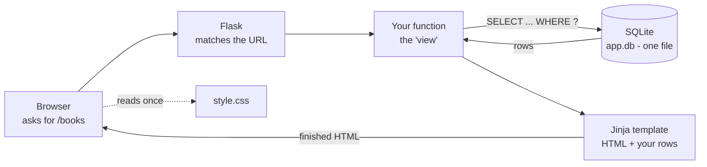

# Flask SQLite stack

**Five pieces, no extras: Flask, HTML, hand-written CSS, SQLite, Jinja2.** You write the SQL yourself with Python's built-in `sqlite3` module — no SQLAlchemy, no form library, no CSS framework. The whole app is files you can read top to bottom.

Flask hub: [[Flask]] · Stack index: [[Stack]] · Look things up: [[Flask reference]]

> ✅ **Everything in these notes was run.** Both projects below were built and tested on Flask 3.1.3, Python 3.14 and SQLite 3.50.4. The test output you'll see is real output, pasted in.

---

## The two projects

Read the stack page (this one), then build a project. They're complete — every file, nothing left as "an exercise for the reader".

| # | Project | What it teaches |
|---|---|---|
| 1 | **[[Flask SQLite - notes app]]** | One file. Accounts, log in, forms, a table of rows, create/edit/delete, search, sort, and the security bits — CSRF, hashed passwords, "you can only see your own stuff" |
| 2 | **[[Flask SQLite - book tracker]]** | A proper package. Blueprints, an app factory, JOINs across four tables, averages and counts, pagination, insert-or-update, and a JSON endpoint |
| ★ | **[[Flask SQLite - showing data on the page]]** | **The cookbook.** 20 worked examples of getting rows onto a page: NULLs, money, dates, 0/1 flags, grouping, totals, sorting, highlighting, JSON — each with its real output |

Project 1 first, even if it looks small. Project 2 assumes you've seen it. **[[Flask SQLite - showing data on the page]]** is the one to keep open while you build — it answers "how do I show *this* on the page?" twenty different ways.

---

## What the five pieces do

| Piece | What it is | Who provides it |
|---|---|---|
| **Flask** | Connects web addresses to Python functions | `pip install flask` |
| **Jinja2** | Builds HTML pages with your data poured in | comes with Flask |
| **HTML** | The structure of a page — headings, forms, tables | the browser ([[HTML]]) |
| **CSS** | What it looks like — colours, spacing, layout | the browser ([[CSS]]) |
| **SQLite** | The database: one file on disk, queried with SQL | comes with Python |

**Nothing else is needed.** `pip install flask` is the only install, because `sqlite3` is part of Python and HTML/CSS are part of the browser.

---

## How a page actually happens



1. Someone opens a URL
2. Flask finds the function you attached to that URL
3. The function asks SQLite for rows
4. It hands those rows to a template, which writes the HTML
5. The browser shows it, and fetches `style.css` to style it

Every page in both projects is those five steps. Nothing else is going on.

---

## Why this stack, and when not to

| Use this when | Use something else when |
|---|---|
| You're learning how the web actually works | — |
| One person, or a few, use the app at once | Hundreds write at the same time → [[PostgreSQL]] |
| The app lives on one machine | It runs on several servers at once → [[PostgreSQL]] |
| You want to see every line of the machinery | You want batteries included → [[Django]] |
| The data is yours — notes, logs, a tracker, a tool | — |

> **SQLite is a real database, not a toy.** It's the most-installed database in the world: your phone, your browser and your car all use it. Its one real limit is **writes**: one at a time, whole-file locked. Thousands of reads per second are fine; many people saving at the same instant is not.

> **Moving to PostgreSQL later is not a rewrite**, as long as you wrote standard SQL. The pieces that change are the `connect()` call, `?` becoming `%s`, and SQLite-only tricks. Notes: [[PostgreSQL]] · [[PostgreSQL with SQLAlchemy]].

---

## Setting it up, start to finish

```bash
mkdir notes_app && cd notes_app

# A virtual environment keeps this project's packages separate from every
# other project's. Skipping it is how you end up with version clashes later.
python -m venv .venv

# Switch it on. The prompt changes to show (.venv) when it worked.
.venv\Scripts\activate        # Windows PowerShell / cmd
source .venv/bin/activate      # macOS, Linux, WSL

pip install flask              # the only install this stack needs

# Write app.py and schema.sql (project 1 has both in full), then:
flask --app app init-db        # creates the database file from schema.sql - once
flask --app app run --debug    # start it, then open http://127.0.0.1:5000
```

| Flag / word | Why it's there |
|---|---|
| `--app app` | the file to look in — `app.py`. Flask also finds `app.py` and `wsgi.py` on its own |
| `--debug` | reloads on every save, and shows the real error instead of "Internal Server Error" |
| `init-db` | **your own** command, defined in `app.py`. Not a built-in |

> ⚠️ **`--debug` on a real server is a security hole, not just untidy.** The friendly error page includes a console that runs any Python a visitor types. It is for your laptop only ([[Security in practice]]).

---

## The folder layout

Flask finds `templates/` and `static/` **by name**, next to your Python file. Rename either and nothing works.

```
notes_app/                 project 1 - small enough for one file
├── app.py                 routes, queries, login - the whole app
├── schema.sql             CREATE TABLE statements
├── notes.db               the database: this ONE file is all your data
├── templates/             .html files, read by Jinja
│   ├── layout.html        the shared shell every page sits in
│   └── index.html
└── static/                files sent to the browser untouched
    └── style.css
```

```
booktracker/               project 2 - once one file gets unwieldy
├── booktracker/
│   ├── __init__.py        create_app() - builds and returns the app
│   ├── db.py              opening, closing and querying the database
│   ├── security.py        login state and CSRF
│   ├── auth.py            a blueprint: register, log in, log out
│   ├── books.py           a blueprint: the list, one book, stats, the API
│   ├── schema.sql
│   ├── templates/
│   └── static/
└── instance/              NOT in git: the database and real secrets
    └── booktracker.db
```

> **Split when one file gets annoying, not before.** 300 lines in one file is easier to read than six files you have to hop between. Project 1 is one file on purpose.

---

## The `sqlite3` module: the seven things you need

This is the whole library, as used by both projects.

```python
import sqlite3

# 1. Connect. If the file doesn't exist, SQLite creates it. No server to start.
conn = sqlite3.connect("notes.db")

# 2. Get rows you can read by NAME. Without this you get plain tuples and have to
#    write row[0], row[1] - which breaks the day you add a column.
conn.row_factory = sqlite3.Row

# 3. Switch foreign keys ON. SQLite ignores them otherwise - per connection,
#    every time. Without it, ON DELETE CASCADE silently does nothing.
conn.execute("PRAGMA foreign_keys = ON")

# 4. Read. Values ALWAYS go in as ? parameters - never glued into the string.
rows = conn.execute("SELECT * FROM notes WHERE user_id = ?", (7,)).fetchall()
row = conn.execute("SELECT * FROM notes WHERE id = ?", (3,)).fetchone()   # one row or None
print(row["title"])                     # thanks to row_factory

# 5. Write, then COMMIT. Without commit() the change is thrown away.
cursor = conn.execute("INSERT INTO notes (user_id, title) VALUES (?, ?)", (7, "Milk"))
conn.commit()
print(cursor.lastrowid)                 # the id SQLite just gave the new row
print(cursor.rowcount)                  # how many rows an UPDATE or DELETE touched

# 6. Many rows at once - far faster than a loop of INSERTs.
conn.executemany("INSERT INTO tags (name) VALUES (?)", [("home",), ("work",)])
conn.commit()

# 7. Run a whole .sql file (several statements). This is what init-db uses.
with open("schema.sql", encoding="utf-8") as f:
    conn.executescript(f.read())
conn.commit()

conn.close()
```

> ⚠️ **The `?` is the single most important character in this note.** Writing `f"... WHERE name = '{name}'"` means a visitor who types `' OR 1=1 --` rewrites your query. With `?`, their text is only ever *data*. Project 1 tests this attack and shows it doing nothing.

> ⚠️ **A one-item tuple needs its comma:** `(7,)` is a tuple, `(7)` is just the number 7, and sqlite3 raises *"parameters are of unsupported type"*. Easiest typo in Python.

> ⚠️ **`?` is for values, never for table or column names.** `ORDER BY ?` doesn't work. When the visitor picks the sort order, look their choice up in a dictionary you wrote and paste *your* value — both projects do this.

---

## SQLite surprises worth knowing now

| Surprise | What to do |
|---|---|
| **No boolean type** | Store `0` and `1`. `pinned INTEGER NOT NULL DEFAULT 0` |
| **No date type** | Store text: `TEXT DEFAULT (datetime('now'))` sorts correctly because `YYYY-MM-DD` sorts alphabetically |
| **Types are suggestions** | SQLite will happily put `"banana"` in an `INTEGER` column. Use `CHECK (...)` when it matters |
| **`DEFAULT` only fires on INSERT** | An `updated_at` has to be set by your `UPDATE`: `SET updated_at = datetime('now')` |
| **`AVG` of nothing is `NULL`** | Which arrives in Python as `None`. Templates need a fallback or they print "None" |
| **One writer at a time** | Fine for this stack. "Database is locked" means two writes collided |
| **`LIKE` ignores case for ASCII** | `LIKE '%apple%'` matches "Apple". For sorting, add `COLLATE NOCASE` |

---

## Reading and writing the database by hand

The database is one file, so any SQLite tool can open it — handy when a page shows the wrong thing and you want to know whether the bug is in the SQL or the template.

```bash
sqlite3 notes.db           # the official command-line tool (sqlite.org/download)

.tables                    # list the tables
.schema notes              # show the CREATE TABLE for one table
.headers on                # show column names in results
.mode column               # line the output up in columns
SELECT * FROM notes LIMIT 5;
.quit
```

> **DB Browser for SQLite** (sqlitebrowser.org) is the free point-and-click version — a spreadsheet view of your tables. The pgAdmin equivalent for SQLite ([[pgAdmin 4]]).

---

## The eight rules of this stack

1. **Values go into SQL as `?` parameters.** Never f-strings. ([[Security in practice]])
2. **`conn.commit()` or it didn't happen.**
3. **Redirect after every successful POST** — otherwise refreshing submits again.
4. **Every query that touches one user's data has `WHERE user_id = ?`.** "Logged in" is not "allowed".
5. **Every POST form carries a CSRF token**, and anything that changes data is a POST — never a link.
6. **Passwords are hashed with `generate_password_hash`**, never stored or logged.
7. **`SECRET_KEY` comes from the environment in production**, and never goes in git.
8. **Validate on the server.** HTML's `required` is a courtesy; anything can POST to your URL.

Rules 4 and 5 are the two that look fine until someone tries them, so both projects include tests that actually try them.

---

## Related

[[Flask]] · [[Flask SQLite - notes app]] · [[Flask SQLite - book tracker]] · [[Flask reference]] · [[Flask - templates with Jinja]] · [[Flask - forms and user input]] · [[Flask - user accounts and login]] · [[HTML]] · [[Forms (HTML)]] · [[CSS]] · [[SQL]] · [[SQL fundamentals]] · [[PostgreSQL]] · [[Python]] · [[pytest]] · [[Security in practice]] · [[Stack]]
