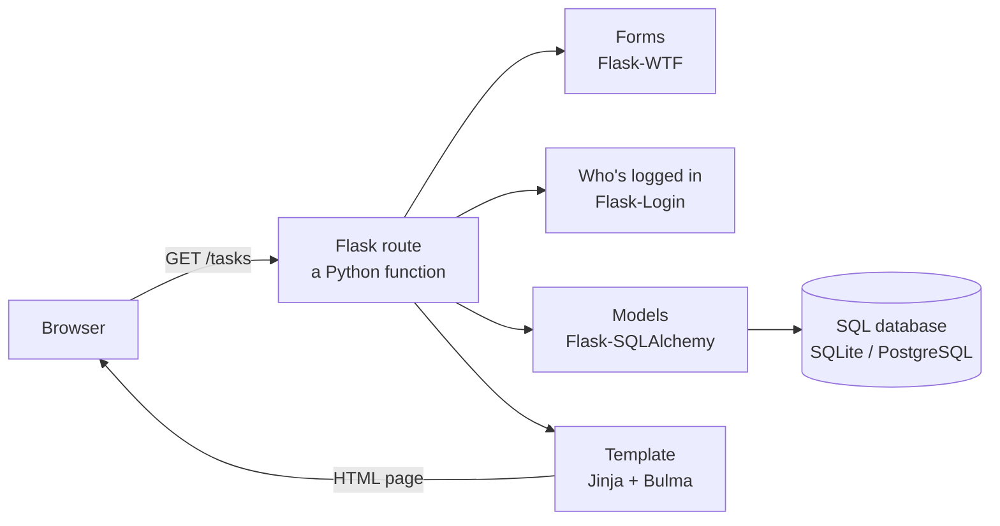

# Flask

**A small Python web framework: you write functions, Flask connects them to web addresses.** Pages in HTML, styled with Bulma, data in a SQL database.

Stack index: [[Stack]] · Language: [[Python]] · Look anything up: **[[Flask reference]]**

> **Want it without the libraries?** [[Flask SQLite stack]] is the same framework with plain `sqlite3`, hand-written CSS and no SQLAlchemy — plus two complete tested projects: [[Flask SQLite - notes app]] and [[Flask SQLite - book tracker]], and a cookbook of [[Flask SQLite - showing data on the page|20 ways to show data on a page]].

---

## What it is, in one picture



1. The **browser** asks for a URL
2. A **route** — an ordinary Python function — handles it
3. It reads a **form**, checks **who's logged in**, and talks to the **database** through Python classes
4. It fills in an HTML **template**, styled with **Bulma**
5. The finished page goes back to the browser

That's every Flask app. The guides below take each box in turn.

---

## The guides — read them in this order

| # | Guide | You'll learn |
|---|---|---|
| 1 | **[[Flask - your first app]]** | Installing on Windows and WSL, routes, how a request works, debug mode |
| 2 | **[[Flask - templates with Jinja]]** | HTML pages, variables, loops, a shared layout, static files |
| 3 | **[[Flask - styling with Bulma]]** | Making it look good — layout, forms, tables, cards, the navbar |
| 4 | **[[Flask - connecting to a SQL database]]** | Tables as Python classes, CRUD, relationships, migrations, Postgres |
| 5 | **[[Flask - forms and user input]]** | Reading forms, validation, error messages, CSRF protection, uploads |
| 6 | **[[Flask - user accounts and login]]** | Register, log in, hashed passwords, users seeing only their own data |
| 7 | **[[Flask - building a JSON API]]** | The backend side — JSON for JavaScript, phone apps and other programs |
| 8a | **[[Flask - project structure and blueprints]]** | The app factory, splitting into files, config and secrets |
| 8b | **[[Flask - deploying it]]** | Gunicorn, Docker, Postgres, going live safely |
| ★ | **[[Flask - full project walkthrough]]** | **A complete task tracker using all of the above — tested code, every file** |
| ★ | **[[Flask SQLite stack]]** | **The no-libraries version: plain `sqlite3`, plain CSS — with [[Flask SQLite - notes app\|two]] [[Flask SQLite - book tracker\|projects]]** |

> **New to Flask?** Read 1–4, then build the walkthrough. Come back to 5–8 as you need them.

---

## When to choose Flask

| Choose | When |
|---|---|
| **Flask** | A website with pages and a database, where you want to understand every piece. Small to medium apps. Learning how the web works |
| **[[Django]]** | A big site with many data types — you want an admin panel, auth and forms built in |
| **[[FastAPI reference\|FastAPI]]** | The product *is* an API for other programs — automatic validation and docs |
| **[[Streamlit]]** | A data dashboard for internal users — no HTML at all |
| **[[NextJs TypeScript\|Next.js]] + [[Actix Web]]** | Your main web stack — a rich interactive frontend |

> **Flask's strength is also its cost.** Nothing is included that you didn't add, so nothing is mysterious — but you choose and wire up the database, forms and login yourself. The guides show the standard choice for each.

---

## The Flask stack

| Layer | Tool | Guide |
|---|---|---|
| Web framework | **Flask** | [[Flask - your first app]] |
| HTML templates | **Jinja** (built in) | [[Flask - templates with Jinja]] |
| Styling | **Bulma** | [[Flask - styling with Bulma]] |
| Database access | **Flask-SQLAlchemy** | [[Flask - connecting to a SQL database]] |
| Schema changes | **Flask-Migrate** | [[Flask - connecting to a SQL database]] |
| Database | **SQLite** locally → **PostgreSQL** in production | [[PostgreSQL reference]] |
| Forms + CSRF | **Flask-WTF** | [[Flask - forms and user input]] |
| Logins | **Flask-Login** + Werkzeug hashing | [[Flask - user accounts and login]] |
| Tests | **pytest** + Flask's test client | [[pytest]] |
| Production server | **Gunicorn** (Linux) / **Waitress** (Windows) | [[Flask - deploying it]] |
| Containers | **Docker** | [[Docker deep dive]] |

```bash
uv add flask flask-sqlalchemy flask-migrate flask-login flask-wtf email-validator python-dotenv
```

---

## The five rules

1. **Redirect after every successful POST** — or refreshing duplicates the submission
2. **Every route that takes an id checks the item belongs to the current user** — `@login_required` alone doesn't
3. **Never debug mode on a server** — the error page runs any code a visitor sends
4. **Passwords are hashed, the `SECRET_KEY` is random and never in git**
5. **Change data only with POST forms carrying a CSRF token** — never plain links

Each one is explained where it comes up, and the walkthrough has tests for the two that are invisible until someone tries them.

---

## Related

[[Flask reference]] · [[Stack]] · [[Python]] · [[HTML]] · [[CSS]] · [[Django]] · [[FastAPI reference]] · [[Streamlit]] · [[SQLAlchemy]] · [[Security in practice]] · [[Setting up a dev machine]]
