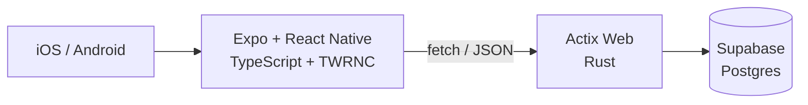

# Primary Native App Stack

Hub: [[Stack]]

[[React Native TypeScript Expo]] (Frontend)

[[Actix Web]] (Backend)

---

## The full picture



| Layer | Technology | Note |
|---|---|---|
| **App** | Expo + React Native | [[Expo]] |
| **Language** | TypeScript | [[TypeScript]] |
| **Styling** | TWRNC (Tailwind for RN) | [[CSS for React Native]] · [[Tailwindcss]] |
| **Navigation** | Expo Router | [[Expo]] |
| **Backend** | Actix Web (Rust) | [[Actix Web]] |
| **Database** | Supabase | [[Supabase]] · [[sqlx]] |
| **Secrets on device** | expo-secure-store | [[Expo]] |

## Same backend, different frontend

**The backend is identical to [[Primary Web App Stack]].** One Actix service serves both the web app and the mobile app — that's the whole point of an API layer, and the same rule as [[Master architecture]]: one door, many clients.

## Mobile-specific things that catch people

| Trap | Note |
|---|---|
| `localhost` means **the phone**, not your laptop | Use the LAN IP or a tunnel ([[Expo]]) |
| All text must be inside `<Text>` | [[Expo]] |
| It isn't CSS — Flexbox only | [[CSS for React Native]] |
| `<FlatList>` for long lists, not `<ScrollView>` | [[Expo]] |
| Tokens go in `expo-secure-store`, not AsyncStorage | [[26 — SECURITY]] |
| `EXPO_PUBLIC_*` vars ship inside the app | Never put a secret there |

## Shipping

```bash
eas build --platform android --profile preview
eas build --platform ios --profile production
eas update --branch production        # JS-only changes, no store review
```

## Related

[[Stack]] · [[Primary Web App Stack]] · [[Expo]] · [[CSS for React Native]] · [[Actix Web]] · [[Supabase]] · [[TypeScript]]
