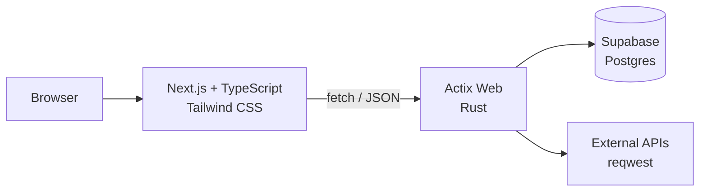

# Primary Web App Stack

Hub: [[Stack]]

[[NextJs TypeScript]] (Frontend)

[[Actix Web]] (Backend)

  

[[API wrappers and how you should work through it]]

---

## The full picture



| Layer | Technology | Note |
|---|---|---|
| **Frontend** | Next.js + React | [[NextJs TypeScript]] |
| **Language** | TypeScript | [[TypeScript]] · [[TypeScript libraries]] |
| **Styling** | Tailwind CSS | [[Tailwindcss]] · [[CSS]] |
| **Markup** | HTML/JSX | [[HTML]] · [[TSX]] |
| **Backend** | Actix Web (Rust) | [[Actix Web]] |
| **Database** | Supabase (Postgres) | [[Supabase]] · [[sqlx]] |
| **Serialisation** | Serde | [[Serde]] |
| **HTTP client** | reqwest | [[reqwest]] |
| **Async runtime** | tokio | [[tokio]] |

## Why this combination

**Rust for the backend** gives you no garbage-collection pauses, tiny memory use, and compile-time guarantees — a container that idles at ~15 MB instead of ~300 MB ([[Rust for this stack]]).

**Next.js for the frontend** gives file-based routing, server rendering and a mature React ecosystem.

**Supabase** gives you Postgres plus auth, storage and realtime without running a database yourself.

> **The trade-off to be honest about:** Rust backends take longer to write than Python or Node ones. Worth it for a long-lived service; overkill for a prototype. For a data/ML API, [[FastAPI reference|FastAPI]] is usually the better call ([[Streamlit vs Django]]).

## How the pieces talk

```typescript
// Next.js -> Actix
const res = await fetch(`${process.env.NEXT_PUBLIC_API_URL}/items`, {
  headers: { Authorization: `Bearer ${token}` },
});
if (!res.ok) throw new Error(`HTTP ${res.status}`);
const items: Item[] = await res.json();
```

```rust
use actix_web::{Responder, get};

// Actix -> Postgres
#[get("/items")]
async fn list(pool: web::Data<PgPool>) -> impl Responder {
    match sqlx::query_as!(Item, "SELECT id, name FROM items").fetch_all(pool.get_ref()).await {
        Ok(items) => HttpResponse::Ok().json(items),
        Err(_)    => HttpResponse::InternalServerError().finish(),
    }
}
```

Don't forget CORS — see [[Setting CORS up]].

## Deployment

| Piece | Where |
|---|---|
| Next.js | Vercel, or a container |
| Actix Web | Container → [[Containers and deployment]] |
| Postgres | Supabase managed |

## Related

[[Stack]] · [[Primary Native App Stack]] · [[NextJs TypeScript]] · [[Actix Web]] · [[Supabase]] · [[Tailwindcss]]
