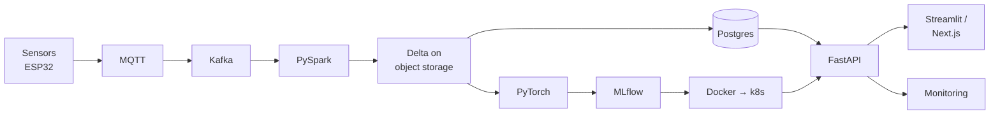

# Stack

Every stack in the vault, and where each piece is documented.

Home: [[The 10x Engineer]] · Knowledge base: [[ULTIMATE ENGINEER]]

---

## The stacks

| Stack | Note |
|---|---|
| **Web app** | [[Primary Web App Stack]] |
| **Python web app** | [[Flask]] — Flask + SQL + Bulma, with a full tested walkthrough |
| **Native app** | [[Primary Native App Stack]] |
| **Data / ML** | [[Data Engineering]] — the curated path |
| **Local, no cloud** | [[Running the whole stack locally]] |

---

## ☁️ Cloud stacks

**Start here: [[Pipeline setup - overview]]** — what all four build, and the order to build it in.

| Stack | End-to-end guide | Notes |
|---|---|---|
| 💻 **Local** | [[Pipeline setup - Local]] | [[SeaweedFS]] · [[Running the whole stack locally]] |
| 🔷 **Azure** | [[Pipeline setup - Azure]] | [[Azure fundamentals]] · [[ADLS Gen2]] · [[Azure SQL Database]] · [[Databricks and Delta Lake]] · [[Azure ML and the MLOps stack]] |
| 🟠 **AWS** | [[Pipeline setup - AWS]] | S3, RDS, Kinesis, EMR, SageMaker |
| 🔵 **GCP** | [[Pipeline setup - GCP]] | GCS, Cloud SQL, Pub/Sub, Dataproc, Vertex AI |

**[[Cloud comparison dictionary]]** — every concept translated across all four. *"What's the Azure equivalent of S3?"* lives here.

---

## By layer

| Layer | Technologies |
|---|---|
| **Frontend** | [[NextJs TypeScript]] · [[Expo]] · [[Streamlit]] · [[Django]] · [[Flask]] · [[Tailwindcss]] · [[Flask - styling with Bulma\|Bulma]] |
| **Backend / API** | [[FastAPI reference]] · [[Actix Web]] · [[Django]] · [[Flask]] |
| **Database** | [[PostgreSQL]] · [[pgAdmin 4]] · [[Azure Database for PostgreSQL]] · [[AWS RDS for PostgreSQL]] · [[Azure SQL Database]] · [[Supabase]] · [[DuckDB]] |
| **Object storage** | [[Object storage]] · [[SeaweedFS]] · [[ADLS Gen2]] · [[AWS S3]] |
| **Streaming** | [[Kafka]] · [[MQTT]] |
| **Processing** | [[PySpark reference]] · [[Databricks and Delta Lake]] · [[Polars]] |
| **ML** | [[Tensors, autograd and the training loop]] · [[scikit-learn]] · [[MLflow experiment tracking]] · [[TensorFlow and Keras]] · [[JAX]] |
| **Serving** | [[Model export and serving]] · [[FastAPI data and deployment]] |
| **Containers** | [[Docker deep dive]] · [[Kubernetes and AKS]] |
| **Infrastructure** | [[Terraform]] |
| **CI/CD** | [[CI-CD pipelines]] · [[Testing and CI-CD]] |
| **Observability** | [[Observability]] · [[Observability for data and ML pipelines]] |
| **Embedded** | [[20 — EMBEDDED]] · [[ESP32 board overview]] |

---

## How it fits together

Every arrow explained: **[[Master architecture]]**

---

## Original stack lines

- **Web app:** Next.js, TypeScript, Tailwind CSS, Actix Web (Rust), Supabase
- **Native app:** Expo + React Native, TypeScript, TWRNC, Actix Web (Rust), Supabase
- **Hardware/embedded:** ESP32, C/C++, breadboard prototyping
- **Observability:** OpenTelemetry, Grafana, Prometheus/Mimir, Loki, Tempo, ClickHouse
- **Machine learning:** Data processing (Rust), math engine (C), orchestration (Rust)
- **Data engineering:** Python, SQL, PySpark, Databricks, Delta Lake on Azure, FastAPI, Streamlit
- **No-cloud mirror:** SeaweedFS, Postgres, Spark, Delta, MLflow, Airflow, Docker

## Related

[[The 10x Engineer]] · [[ULTIMATE ENGINEER]] · [[Languages]] · [[Tools]] · [[I HAVE A PROBLEM]]
