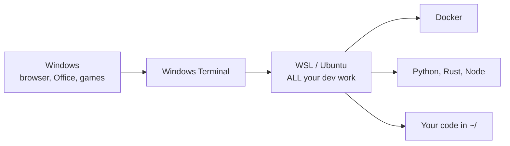

# Setting up a dev machine

From a fresh Windows install to everything in this vault working. Section: [[Tools]]

---

## Read this first: why WSL

Windows is a fine desktop. But **almost every tool in this vault was written for Linux** — Docker, Spark, most Python data libraries, every deployment target.

**WSL (Windows Subsystem for Linux)** runs a real Linux kernel inside Windows. You get Linux tooling and Windows for everything else, on one machine, sharing files.

> **The recommendation: do all your development inside WSL.** Windows stays your desktop; WSL is your dev machine. Everything below assumes that.



---

## Step 1 — Install WSL

Open **PowerShell as Administrator** (right-click Start → Terminal (Admin)):

```powershell
wsl --install
```

That single command installs WSL2 and Ubuntu. **Reboot when it asks.**

On first launch it asks for a username and password. This is your **Linux** user — nothing to do with your Windows account. The password is for `sudo`; you'll type it often, and **it shows nothing as you type** (that's normal, not a broken keyboard).

```powershell
wsl --list --verbose        # check it's version 2
wsl --update
wsl --shutdown              # restart WSL if it misbehaves
```

| Command | Does |
|---|---|
| `wsl` | Enter Linux |
| `exit` | Back to Windows |
| `wsl --shutdown` | Full restart — the fix for most WSL weirdness |

## Step 2 — Windows Terminal

```powershell
winget install Microsoft.WindowsTerminal
```

Then **Settings → Startup → Default profile → Ubuntu**, so opening a terminal drops you straight into Linux.

Install a **Nerd Font** or icons in [[Nvim]] and modern CLI tools render as boxes:

```powershell
winget install DEVCOM.JetBrainsMonoNerdFont
```

Set it in Terminal → Settings → Ubuntu → Appearance → Font face → `JetBrainsMono Nerd Font`.

## Step 3 — ⚠️ The filesystem rule

**This is the single most important thing on this page.**

```bash
~/projects/myapp          # ✅ FAST  - the Linux filesystem
/mnt/c/Users/you/myapp    # ❌ SLOW - Windows files seen from Linux
```

> **Keep your code in `~/` (the Linux side).** Crossing the filesystem boundary is dramatically slower — a `uv sync` that takes 3 seconds in `~` can take several minutes on `/mnt/c`. Same for `git status`, Docker builds and test runs.
>
> This catches essentially everyone, and it presents as "WSL is slow" rather than as a path problem.

**To open your Linux files in Windows Explorer:**
```bash
explorer.exe .
```
Or type `\\wsl$\Ubuntu\home\<you>` into Explorer's address bar.

## Step 4 — Update Ubuntu and install essentials

```bash
sudo apt update && sudo apt upgrade -y

sudo apt install -y \
  build-essential curl wget git unzip \
  ripgrep fd-find jq tree htop \
  python3-pip python3-venv \
  pkg-config libssl-dev
```

| Package | Why |
|---|---|
| `build-essential` | gcc/make — needed to compile almost anything |
| `ripgrep` (`rg`) | Fast search. [[Nvim]] and Telescope need it. |
| `fd-find` | Fast file finding |
| `jq` | JSON on the command line ([[jq]]) |
| `curl` / `wget` | Downloading |

```bash
# Ubuntu installs fd as fdfind - alias it
echo 'alias fd=fdfind' >> ~/.bashrc && source ~/.bashrc
```

## Step 5 — Git

```bash
git config --global user.name "Your Name"
git config --global user.email "you@example.com"
git config --global init.defaultBranch main
git config --global pull.rebase true
git config --global core.autocrlf input        # <- line endings, see below
```

> ⚠️ **`core.autocrlf input` matters on Windows/WSL.** Windows uses CRLF line endings, Linux uses LF. Without this you get diffs where every single line changed, and shell scripts that fail with `bad interpreter: /bin/bash^M`.

### SSH key for GitHub

```bash
ssh-keygen -t ed25519 -C "you@example.com"     # press Enter for defaults
cat ~/.ssh/id_ed25519.pub                       # copy this
```

Paste it into **GitHub → Settings → SSH and GPG keys → New SSH key**.

```bash
ssh -T git@github.com                           # should greet you by name
```

Full git usage: [[Dev environment - Git, Docker, CLI]] · [[Git-GitHub]]

## Step 6 — Python with uv

```bash
curl -LsSf https://astral.sh/uv/install.sh | sh
source ~/.bashrc

uv --version
uv python install 3.12
```

```bash
uv init myproject && cd myproject
uv add pandas fastapi
uv add --dev pytest ruff mypy
uv run python main.py
```

> **uv replaces pip, venv, virtualenv, pyenv and pip-tools**, and is 10–100× faster. Don't install Python from python.org on Windows *and* in WSL — that's how you end up confused about which one is running. See [[Packaging and environments]].

## Step 7 — Docker

Install **Docker Desktop on Windows** (not inside WSL):

```powershell
winget install Docker.DockerDesktop
```

Then **Settings → Resources → WSL Integration → enable for Ubuntu**.

```bash
docker --version                # from inside WSL
docker run hello-world
```

> **Docker Desktop runs the engine on Windows and exposes it to WSL.** Installing Docker separately inside WSL as well causes two competing daemons and confusing errors.

Limit its resource use — Docker Desktop will happily eat all your RAM. Create `C:\Users\<you>\.wslconfig`:

```ini
[wsl2]
memory=8GB
processors=4
swap=2GB
```

Then `wsl --shutdown` and reopen.

Full usage: [[Docker deep dive]]

## Step 8 — Node (for the web stack)

```bash
curl -o- https://raw.githubusercontent.com/nvm-sh/nvm/v0.40.1/install.sh | bash
source ~/.bashrc
nvm install --lts
node --version && npm --version
```

> **Use `nvm`, not apt.** Different projects need different Node versions, and `nvm use 20` switches instantly. See [[JavaScript libraries]].

## Step 9 — Rust

```bash
curl --proto '=https' --tlsv1.2 -sSf https://sh.rustup.rs | sh
source ~/.cargo/env
rustc --version && cargo --version
```

```bash
rustup component add rust-analyzer clippy rustfmt
```

See [[Rust]] · [[Rust crates]]

## Step 10 — Neovim

```bash
sudo add-apt-repository ppa:neovim-ppa/unstable -y
sudo apt update && sudo apt install -y neovim
nvim --version
```

> The version in plain `apt` is usually years old. Use the PPA or the AppImage.

Full setup including the **WSL clipboard fix**: [[Configuration]]

## Step 11 — VS Code (optional, alongside Nvim)

Install on **Windows**, then add the **WSL extension**. From inside WSL:

```bash
code .
```

It opens on Windows but runs the language servers inside Linux — the correct arrangement.

## Step 12 — GPU / CUDA in WSL (optional)

Only if you have an NVIDIA card and want [[CUDA and GPU programming]].

1. Install the **NVIDIA driver on Windows** — the normal one from nvidia.com.
2. **Do not install a driver inside WSL.** WSL uses the Windows one.

```bash
nvidia-smi                       # should list your GPU from inside WSL
```

```bash
# CUDA toolkit inside WSL (check NVIDIA's current instructions for your version)
sudo apt install -y nvidia-cuda-toolkit
nvcc --version
```

```python
import torch; torch.cuda.is_available()        # True
```

> **The most common mistake is installing a Linux GPU driver inside WSL.** It breaks the passthrough. Windows driver only.

## Step 13 — Cloud CLIs

```bash
# Azure
curl -sL https://aka.ms/InstallAzureCLIDeb | sudo bash
az login

# AWS
curl "https://awscli.amazonaws.com/awscli-exe-linux-x86_64.zip" -o awscliv2.zip
unzip awscliv2.zip && sudo ./aws/install
aws configure

# GCP
curl https://sdk.cloud.google.com | bash && exec -l $SHELL
gcloud init
```

Then: [[Pipeline setup - Azure]] · [[Pipeline setup - AWS]] · [[Pipeline setup - GCP]]

---

## A useful `.bashrc`

```bash
# ~/.bashrc additions
export EDITOR=nvim
alias ll='ls -lah'
alias gs='git status'
alias gd='git diff'
alias gl='git log --oneline --graph -20'
alias dc='docker compose'
alias fd=fdfind
alias open='explorer.exe'

# uv, cargo, nvm on PATH
export PATH="$HOME/.local/bin:$HOME/.cargo/bin:$PATH"
```

```bash
source ~/.bashrc        # apply without reopening the terminal
```

---

## Native Linux (no Windows)

Everything from Step 4 onward is identical. Skip WSL and Docker Desktop; install Docker Engine directly:

```bash
curl -fsSL https://get.docker.com | sh
sudo usermod -aG docker $USER      # then LOG OUT AND BACK IN
docker run hello-world
```

> **The `usermod` needs a full logout** to take effect. Until then every docker command needs `sudo`.

---

## The verification checklist

```bash
wsl --list --verbose      # (from PowerShell) Ubuntu, VERSION 2
git --version
uv --version
docker run hello-world
node --version
cargo --version
nvim --version
az version
nvidia-smi                # only if you have a GPU
```

```bash
mkdir -p ~/projects && cd ~/projects      # ✅ NOT /mnt/c
```

---

## Troubleshooting

| Symptom | Cause | Fix |
|---|---|---|
| **Everything is slow** | Code is on `/mnt/c` | **Move it to `~/`** |
| `docker: command not found` in WSL | WSL integration off | Docker Desktop → Settings → Resources → WSL Integration |
| `bad interpreter: /bin/bash^M` | CRLF line endings | `git config --global core.autocrlf input`; `dos2unix file` |
| Git shows every line changed | Same | Same |
| WSL using all my RAM | No limit set | `.wslconfig` with `memory=8GB`, then `wsl --shutdown` |
| WSL won't start / acts strangely | — | `wsl --shutdown` then reopen |
| `nvidia-smi` not found in WSL | Driver installed inside WSL | Windows driver only; `wsl --update` |
| Icons are boxes in the terminal | No Nerd Font | Install one and set it in Terminal settings |
| `"+y` in Nvim does nothing | No clipboard provider | The WSL clipboard block in [[Configuration]] |
| Permission denied on docker | Not in the docker group (native Linux) | `sudo usermod -aG docker $USER`, log out and in |
| `sudo` password not appearing | It never does | Type it anyway and press Enter |
| Python is the wrong version | Multiple installs | Use `uv run`; check `which python3` |
| Port already in use | Windows and WSL share localhost | `ss -tlnp` in WSL, `netstat -ano` in PowerShell |

More: [[I HAVE A PROBLEM]] · [[_Troubleshooting template]]

---

## What to do next

1. **[[Pipeline setup - Local]]** — bring up the whole data stack on your laptop, free
2. **[[Project 001 — Aircraft Engine Sensor Analyzer]]** — the first build
3. **[[Command reference]]** — every command in the vault, one page

## Related

[[Tools]] · [[Dev environment - Git, Docker, CLI]] · [[Docker deep dive]] · [[Configuration]] · [[Packaging and environments]] · [[Running the whole stack locally]] · [[Command reference]]
